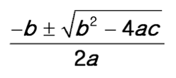

# 2021.01.18 Homework


## 1. Python 예약어

> python에서 사용할 수 없는 식별자(예약어)를 찾아 작성하시오.


```python
import keyword
print(keyword.kwlist)

# 결과
['False', 'None', 'True', 'and', 'as', 'assert', 'async', 'await', 'break', 'class', 'continue', 'def', 'del', 'elif', 'else', 'except', 'finally', 'for', 'from', 'global', 'if', 'import', 'in', 'is', 'lambda', 'nonlocal', 'not', 'or', 'pass', 'raise', 'return', 'try', 'while', 'with', 'yield']
```


## 2. 실수 비교

> python은 부동소수점 방식을 이용하여 실수(float)를 표현하는 과정에서, 나타내고자 하는 값과의 오차가 발생하여 원하는 대로 연산 또는 비교가 되지 않을 때가 있다. 이를 참고하여, 아래와 같은 두 실수 값을 올바르게 비교하기 위한 코드를 작성하시오.


```python
num1 = 0.1 * 3
num2 = 0.3
```


## 3. 이스케이프 시퀀스

> (1) 줄 바꿈, (2) 탭, (3) 백슬래시를 의미하는 이스케이프 시퀀스를 작성하시오.


```python
answer1=print('\n정답')
answer2=print('\t정답')
answer3=print('\\정답')
```


## 4. String Interpolation

> “안녕, 철수야"를 string interpolation을 사용하여 출력하시오.


```python
name = '철수'

answer1 = print('안녕, {}야'.format(name))
answer2 = print(f'안녕, {name}야')
```


## 5. 형 변환

> 다음 중, 실행 시 오류가 발생하는 코드를 고르시오.


```python
str(1) # (1)
int('30') # (2)
int(5) # (3)
bool('50') # (4)
int('3.5') # (5)

# 정답.

int('3.5') # 정수형 스트링 타입은 자동 변환되지만 실수형은 그렇지 않다.
```


## 6. 네모 출력

> 두 개의 정수 n과 m이 주어졌을 때, 가로의 길이가 n, 세로의 길이가 m인 직사각형 형태를 별(`*`) 문자를 이용하여 출력하시오. 단, 반복문은 사용할 수 없다.


## 7. 이스케이프 시퀀스 응용

> `print()` 함수를 한 번만 사용하여 다음 문장을 출력하시오.

```
"파일은 c:\Windows\Users\내문서\Python에 저장이 되었습니다."
나는 생각했다. 'cd를 써서 git bash로 들어가 봐야지.'
```


## 8. 근의 공식

> 다음은 이차 방정식의 근을 찾는 수식이다. 이를 파이썬 코드로 작성하시오.



```python
answer1 = -b+
```

