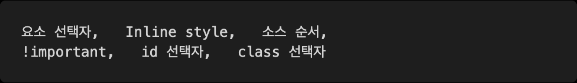

# Homework 0201

> HTML & CSS

* HTML elements
* CSS syntax


## 1.  HTML 정의

아래의 보기 (1) ~ (4) 중에서, HTML의 본딧말을 고르시오.

(1) Hyperlinks and Text Markup Language
(2) Home Tool Markup Language
(3) Hyper Text Markup Language
(4) Hyper Tool Markup Language


**(3) Hyper Text Markup Language**


## 2. HTML 개념

각 문항을 읽고 맞으면 T, 틀리면 F를 작성 하시오.

```
1. 웹 표준을 만드는 곳은 Mozilla 재단이다.
2. 표(table)을 만들 때에는 반드시 <th> 태그를 사용해야 한다.
3. 제목(Heading)태그는 제목 이외에는 사용하지 않는 것이 좋다.
4. 리스트를 나열하기 위해서는 <ul> 태그만 사용 할 수 있다.
5. HTML의 태그는 반드시 별도의 닫는 태그가 필요하다.
```


1. 웹표준을 만드는 곳은 W3C, WHATWIG 이다. 실시간으로 계속 바뀐다. (F)
2. 반드시 사용할 필요는 없다. (F)
3. 사용하지 않는것이 좋다. (T)
4. `ul` 아래에 있는것이 `il` 이다. 순서 없는것 `ul` 있는것 `ol` (F)
5.  `input` , `meta` 등의 닫는태그가 필요없는것도 존재한다.


## 3. CSS 정의

아래의 보기 (1) ~ (4) 중에서, CSS의 본딧말을 고르시오.


(1) Creative Style Sheets
(2) Cascading Style Sheets
(3) Computer Style Sheets
(4) Colorful Style Sheets


**(2) Cascading Style sheets**


## 4. CSS 개념

각 문항을 읽고 맞으면 T, 틀리면 F를 작성하시오.

1) HTML과 CSS는 각자 문법을 갖는 별개의 언어이다.
2) 웹 브라우저는 내장 기본 스타일이 있어 CSS가 없어도 작동한다.
3) 자식 요소 프로퍼티는 부모의 프로퍼티를 모두 상속 받는다.
4) 디바이스마다 화면의 크기가 다른 것을 고려하여 상대 단위인 %를 사용한다.
5) id 값은 유일해야 하므로 중복되어서는 안된다.


1. (T)  별개의 언어이지만 혼자로써는 의미가 없을 뿐이다. 다른 언어이다.
2. (T) 기본적으로 정해져 있다.
3. (F) 모두는 아니고 보통 상속시 color, font-size등의  text관련된것(외울 필요는 없다.)
4. (F) 사용자가 보고 있는 화면크기는 viewport 라고 부르고 이것을 기준으로 값을 바꿔줄 수 있다.
5. (T) Id값은 유일해야한다. 문서내에서


## 5. CSS 우선순위

CSS는 우선 적용되는 순서가 존재한다. 우선순위가 높은 순으로 나열하시오.




1. !important( 최대한 발생 안하게끔)
2. Inline style (태그 안에다가 style 써주는 것)( 이것 역시 최대한 안쓰는것)
3. id 선택자
4. class 선택자
5. 요소 선택자 (element)
6. 소스 순서


