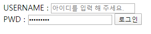

# Homework 0202

> HTML & CSS

* HTML Layout
* CSS Selector


## 1. Semantic Tag

보기 중 콘텐츠의 의미를 명확히 하기 위해 HTML5에서 새롭게 추가된 시맨틱(semantic)태그를 모두 고르시오

```
div, header, h1, section, footer, a, form, sapn
```

header, section, footer


## 2. input Tag

아래 이미지와 같이 로그인 Form을 생성하는 HTML코드를 작성하시오.

단, USERNAME 글자를 클릭하면 아이디를 입력하는 input에, PWD 글자를 클릭하면 비밀번호를 입력하는 input에 focusing 되도록 하시오.



```html
 <section>
    <form action="#">
    <div>
      <!-- label과 input은 for와 id가 같아야 연결이 된다. -->
      <label for="username">USERNAME : </label>
      <input type="text" id="username" placeholder="아이디를 입력 해 주세요.">

    </div>
    <!-- <br> 태그 이용해서 줄바꿈해도됨 (굳이 div 태그안걸어도 됨) -->
    <div>
      <label for="password">PWD : </label>
      <input type="password" id="password">
      <!-- <input type="submit value="로그인"> -->
      <button type="submit">로그인</button>
    </div>

    </form>

  </section>
```


## 3. 크기단위

크기 단위 em은 요소에 지정된 상속된 사이즈나 기본 사이즈에 대해 상대적인 사이즈를 설정한다. 즉, 상속의 영향으로 사이즈가 의도치 않게 변경될 수 있는데 이를 예방하기 위해 HTML 최상위 요소의 사이즈를 기준으로 삼는 크기 단위는 무엇인가?


rem


## 4. 선택자

다음 예제를 통해 '자손 선택자'와 '자식 선택자'의 차이를 설명하시오.

```css
/* 자손 선택자 */
div p {
  color: crimson;
}

/* 자식 선택자 */
div> p {
  color: crimson;
}
```


자식 선택자는 바로 아래의 상속관계에 있는 선택자만 해당이 되지만 자손 선택자는 상속관계 아래에 있는 모든 해당 태그에 상속 할 수 있다.