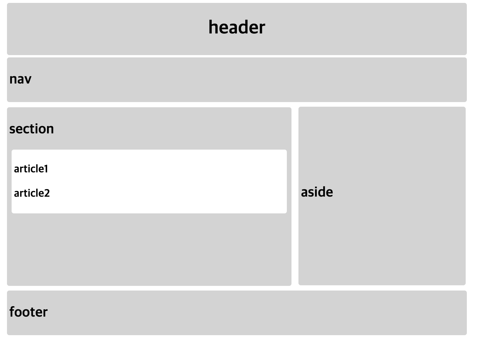

# Workshop 0202

> HTML&CSS

* Layout 구조의 이해
* CSS Property의 이해


## 1. Semantic Tag

제시된 semantic.html과 semantic.css를 수정하여 다음 이미지와 같은 형태가 되도록 코드를 작성하시오.




```html
<!DOCTYPE html>
<html lang="ko">
<head>
  <meta charset="UTF-8">
  <meta name="viewport" content="width=device-width, initial-scale=1.0">
  <link rel="stylesheet" href="semantic.css">
  <title>Layout Practice</title>
</head>
<body>
  <header class="lgrey-back mar-4 pad-4 border-radius">
    <h1 class="text-center">header</h1>
  </header>
  <nav class="lgrey-back mar-4 pad-4 border-radius">
    <h2>nav</h2>
  </nav>
  <section class="lgrey-back mar-4 pad-4 inline-block border-radius">
    <h2>section</h2>
    <article class="white-back mar-4 pad-4 border-radius">
      <h3>article1</h3>
      <h3>article2</h3>
    </article>
  </section>
  <aside class="lgrey-back mar-4 pad-4 inline-block vertical-top border-radius">
    <h2>aside</h2>
  </aside>
  <footer class="lgrey-back mar-4 pad-4 border-radius">
    <h2>footer</h2>
  </footer>
</body>
</html>

```


```css
body {
  font-family: Arial;
  width: 800px;
}

/* 
  클래스로 스타일링하는 법 손에 익히기!

  1) 공통적으로 적용될 수 있는 스타일을 클래스 형태로 미리 만들어 둔다.
  2) HTML에서 내가 원하는 곳에 클래스를 삽입해서 해당 스타일을 적용한다.

*/

/* 모든 스타일링 요소를 클래스로 만들어 사용합니다. */

/* 1. article 태그는 white로 나머지 시멘틱 태그는 lightgrey로 배경색을 바꿔주세요. */
.white-back{
  background-color: white;
}
.lgrey-back{
  background-color: lightgray;
}
/* 2. 모든 시멘틱 태그의 margin과 padding을 4px로 만들어주세요. */
.mar-4{
  margin: 4px;
}
.pad-4{
  padding: 4px;
}

/* 3. h1 태그를 중앙 정렬 시켜주세요. */
.text-center{
  text-align: center;
}

/* 4. section과 aside 태그의 display를 inline-block으로 바꿔주세요. */
.inline-block{
  display: inline-block
}

/* 5. section 태그는 width 482px height 300px, aside 태그는 width 280px height 300px로 만들어주세요.*/
section{
  width: 482px;
  height: 300px;
}
aside{
  width: 280px;
  height: 300px;
}

/* 6. aside 태그에 vertical-align속성의 값을 top으로 적용해주세요.*/
.vertical-top{
  vertical-align: top;
}

/* 7. 모든 semantic 태그의 border 모서리 반경을 4px로 만들어주세요. */

.border-radius{
  border-radius: 4px;
}
```

5번의 경우를 제외하고 모두 class를 적용시키는 연습을 하였다.

