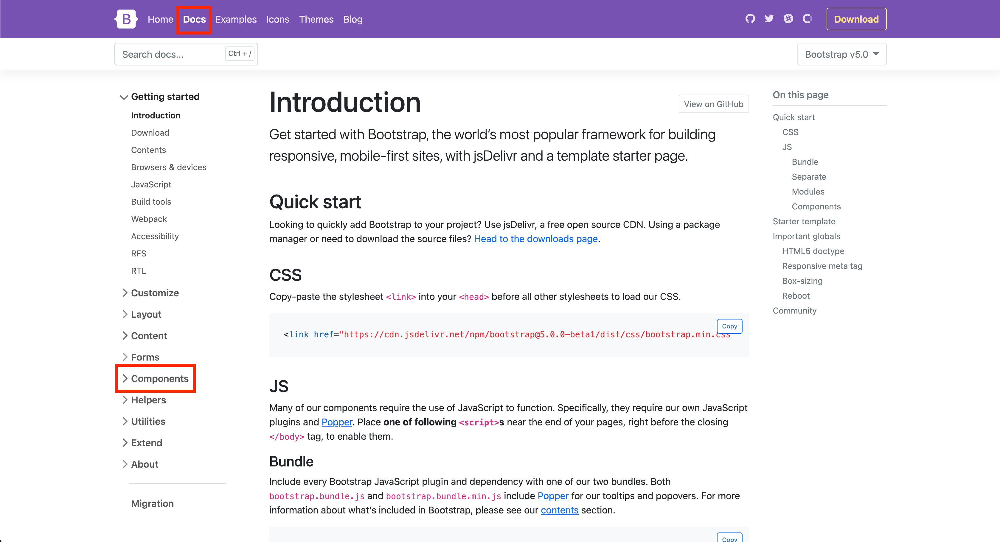
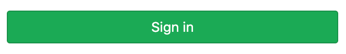
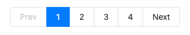
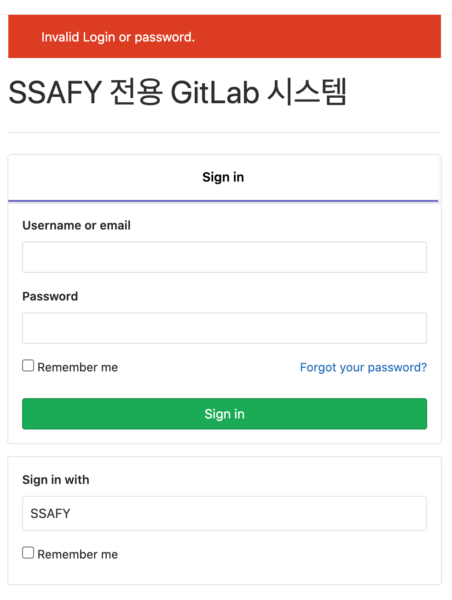

## Homework 0203

>Grid System & Responsive Web

* Bootstrap
* Bootstrap Component


## Bootstrap



공식 문서의 Component를 활용하여 물음에 답하시오.

1) 각 문항에 제시된 이미지는 현재 lab.ssafy.com에서 사용중인 components이다. 제시된 요소에 사용된 Bootstrap Component가 무엇인지 작성하시오.


2) 위에서 답한 Bootstrap Component를 사용하여 제시된 요소와 유사한 형태가 되도록 코드를 작성하시오.


## 1. Components



1)  Buttons

2)  success-초록 /ld-lg 크게함/ w-50 늘려주기위해서 임으로 설정함

```html
<button type="button" class="btn btn-success d-lg w-50">Sign In</button>
```


## 2. Components


## 3. Components



1) Pagination

2)

```html
<nav aria-label="...">
    <ul class="pagination fw-bold justify-content-center">
      <li class="page-item disabled">
        <a class="page-link text-grey" href="#" tabindex="-1" aria-disabled="true">Prev</a>
      </li>
      <li class="page-item active"><a class="page-link" href="#">1</a></li>
      <li class="page-item" aria-current="page">
        <a class="page-link text-dark" href="#">2</a>
      </li>
      <li class="page-item"><a class="page-link text-dark" href="#">3</a></li>
      <li class="page-item"><a class="page-link text-dark" href="#">4</a></li>
      <li class="page-item">
        <a class="page-link text-dark" href="#">Next</a>
      </li>
    </ul>
  </nav>
```


## 4. Login Page




```html
<div class="container p-0 border">
    
    <div class="border-bottom">
      <h3 class="fw-bold text-center mb-5">Sign in</h3>
    </div>
    
    <form class="p-2">
      <div class="mb-3 mt-3">
        <label for="exampleInputEmail1" class="form-label fw-bold">Username or email</label>
        <input type="email" class="form-control" id="exampleInputEmail1" aria-describedby="emailHelp">
      </div>
      <div class="mb-3">
        <label for="exampleInputPassword1" class="form-label fw-bold">Password</label>
        <input type="password" class="form-control" id="exampleInputPassword1">
      </div>
      <div class="d-flex justify-content-lg-between mb-3">
        <div class="mb-3 form-check">
          <input type="checkbox" class="form-check-input" id="exampleCheck1">
          <label class="form-check-label" for="exampleCheck1">Remember me</label>
        </div>
        <div class="mb-3">
          <a href="#" class="text-decoration-none fw-bold">Forgot your password?</a>
        </div>
      </div>
      <button type="submit" class="btn btn-success btn-lg w-100">Submit</button>
      
    </form>
  </div>
```

