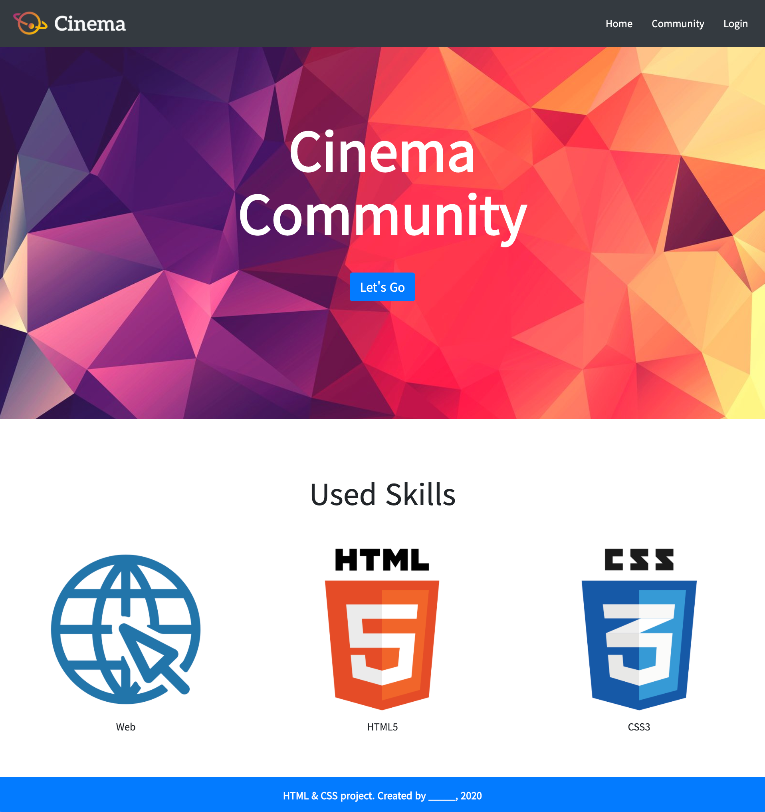

# Workshop

>Grid System & Responsive Web


* Bootstrap
* Bootstrap의 이해
* Bootstrap Component 활용


## Bootstrap Component

아래의 페이지를 Bootstrap Class를 활용하여 작성하시오.

1) 각 요소(nav, header, section, footer)는 주어진 코드의 주석에 맞춰 작성합니다.

2) 모든 이미지 요소는 주어진 이미지 파일을 활용합니다.

3) 모든 구성 요소 배치는 flexbox를 활용 합니다.

4) 모든 텍스트 스타일은 공식 문서의 typography를 참고하여 작성합니다.




## nav


1) 네비게이션 바는 항상 브라우저 화면 최상단에 고정되어 있습니다.

2) 네비게이션 바의 배경색은 공식 문서의 background color 를 참고하여 작성합니다.

3) 로고 이미지와 네비게이션 리스트는 각각 네비게이션 바 양 끝에 배치합니다.

4) 리스트의 항목 간 간격은 2rem입니다. 공식 문서의 spacing을 참고하여 작성합니다.

5) 리스트의 각 항목들은 마우스를 올렸을 때, 밑줄이 나오지 않도록 설정합니다.

6) 위에 명시된 내용 이외에는 자유롭게 작성합니다.


```html
<!-- 1. Nav -->
<!-- 뷰포트 기준으로 붙게 하기  -->
<!-- bg-dark 써서 검은색 배경 -->
<!-- 양끝에 붙게하기 위해서 d-flex씀  -->
<nav class="fixed-top bg-dark d-flex justify-content-between">
    <a href="#">
        
    </a>
    <!-- 수평으로 바꿔줘야함 -->
    <!-- bootstrap docs 들어가서  -->
    <!-- 리스트 간격 맞추기 위해서 2rem -->
    <!-- 양쪽 1rem으로 접근 -->
    <!-- a태그의 기본형인 파란색 제거 -->
    <!-- 글자색 하얀색 -->
    <!-- 글자들 가운데로 -->
    <!-- ul 태크의 마진 없애기 -->
    <!-- ul 태그 기본으로 생기는 점 없애기 -->
    <!-- 오른쪽 살짝 띄워주기 -->
    <ul class="d-flex align-items-center mb-0 me-3 list-unstyled">
        <li><a href="#" class="mx-3 text-decoration-none text-white">Home</a></li>
        <li><a href="#" class="mx-3 text-decoration-none text-white">Community</a></li>
        <li><a href="#" class="mx-3 text-decoration-none text-white">Login</a></li>
    </ul>
</nav>
```


## Header


1) Header 내부의 요소(글, 버튼)는 수직, 수평 중앙에 배치 합니다.

2) Header 내부의 글씨 색상은 흰색이며, 굵기는 bold 입니다.

3) Header 내부의 글씨 크기는 공식 문서의 display heading을 활용합니다.

4) Header 내부의 버튼의 색상은 파란색이며 크기는 크게 설정합니다.

5) 위에 명시된 내용 이외에는 자유롭게 작성합니다.


```html
<!-- 2. Header -->
<!--  주축을 바꿔주기 -->
<!-- 수평 수직 정렬 -->
<!-- 글자 하얀색 -->
<!-- font weight bold -->
<!-- display 이용 글자 크게 -->
<!-- btn 만들기 -->
<!-- btn primary 통해 버튼처럼 -->
<!-- btn 크게 -->
<!-- 위에 조금 떨어트리기 -->
<header class="d-flex flex-column justify-content-center align-items-center">
    <div class="display-1 text-white fw-bold">Cinema</div>
    <div class="display-1 text-white fw-bold">Community</div>
    <a href="#" class="btn btn-primary btn-lg mt-4">Let's Go</a>
</header>
```


## Section


1) Section 내부의 요소(글, 이미지)는 수평 중앙에 배치 합니다.

2) Section 내부의 3개의 이미지는 수평으로 나열되어 있습니다.

3) Section 내부의 이미지간 간격은 동일합니다.

4) Section 내부의 이미지 아래에는 이미지를 설명하는 간단한 글이 있습니다.

5) 위에 명시된 내용 이외에는 자유롭게 작성합니다.


```html
<!-- 3. Section -->

<section>
    <!-- h2 태그는 블락속성이니깐 너비를 다가지고 있음 -->
    <h2 class="text-center my-5">Used Skills</h2>
    <!-- article 밑의 세개를 수평으로 -->
    <!-- 센터해서 마진을 줘도 되고 그냥 around 사용해도 됨 -->
    <article class="d-flex justify-content-center">
        <div class="mx-5 text-center">
            
            <p>Web</p>
        </div>
        <div class="mx-5 text-center">
            
            <p>HTML5</p>
        </div>
        <div class="mx-5 text-center">
            
            <p>CSS3</p>
        </div>
    </article>
</section>
```


## Footer


1) Footer는 항상 브라우저 화면 최하단에 고정되어 있습니다.

2) Footer의 배경색은 파란색입니다.

3) Footer에 작성된 내용은 수직, 수평 중앙에 배치 합니다.

4) Footer에 작성된 내용의 빈 부분( _____ )은 본인의 이름을 작성해 주세요.

5) 위에 명시된 내용 이외에는 자유롭게 작성합니다.


```html
<!-- 4. Footer -->

<!-- 항상 최하단에 고정 -->
<!-- 파란색 배경 -->
<!-- 좌우 중앙정렬 -->
<!-- 텍스트 하얀색 -->
<footer class="fixed-bottom bg-primary d-flex justify-content-center align-items-center text-white">
    <!-- 마진바텀이 들어가 있어서 0줌 -->
    <p class="mb-0">HTML & CSS project. Created by zero-bacteria</p>
</footer>
```

