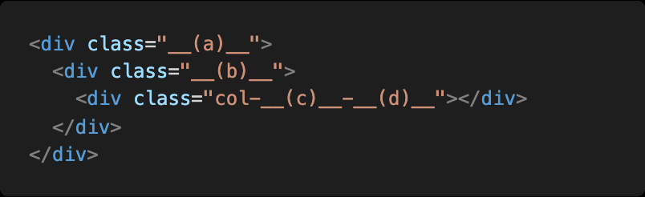

# Homework 0204

> Grid System & Responsive Web

* CSS Felxible Box Layout
* Bootstrap Grid System


## 1. CSS flex-direction

Flex box의 주축을 변경하는 flex-direction의 4가지 값과 각각의 특징을 작성하시오.


| 값             | 축 방향 | 순서            |
| -------------- | ------- | --------------- |
| row            | 수평    | 정방향 (좌->우) |
| row-reverse    | 수평    | 역방향 (우->좌) |
| column         | 수직    | 정방향 (상->하) |
| column-reverse | 수직    | 역방향 (하->상) |


## 2. Bootstrap flex-direction

flex-direction의 4가지 요소와 대응하는 bootstrap 클래스를 작성하시오.


- `flex-row`
- `flex-row-reverse`
- `flex-column`
- `flex-column-reverse`


## 3. align-items

align-items 속성의 4가지 값과 각각의 특징을 작성하시오.


align-itmes 교차축을 정렬해주는 기능을 가지고 있다.

| 값      | 특징                       |
| ------- | -------------------------- |
| stretch | 교차축에 가득차도록 늘려줌 |
| center  | 교차축 중앙에 정렬해줌     |
| start   | 교차축 시작점에 정렬       |
| end     | 교차축 끝점에 정렬         |


## 4. flex-flow

flex-flow 속성은 두가지 속성의 축약형이다. 올바르게 짝지어진 것을 고르시오.

(1) flex-direction, flex-wrap
(2) flex-direction, align-items
(3) justify-content, flex-wrap
(4) justify-content, align-items


(1) flex-direction, flex-wrap의 축약형이다.


## 5. Bootstrap Grid System

하단 코드에 Bootstrap Grid System을 적용시키고자 할 때, __(a)__, __(b)__ 각각에
입력해야 할 클래스 이름을 작성하시오.




(a) row

(b) col


## 6. Breakpoint prefix

Bootstrap Grid System에서 요소의 크기를 지정하기 위해서는 상단 코드와 같은 형태로 클래스 이름을 지정해야 한다.


1) __(c)__에 들어갈 수 있는 값과 그 값들이 가지는 의미를 작성하시오.


``` 
뷰포트의 범위를 지정해주는 값이 들어가야한다. 그 값과 특성으로는 다음 표와 같다.
```

|                       | xs <576px                                                    | sm ≥576px  | md ≥768px  | lg ≥992px  | xl ≥1200px | xxl ≥1400px |
| --------------------- | ------------------------------------------------------------ | ---------- | ---------- | ---------- | ---------- | ----------- |
| Container `max-width` | None (auto)                                                  | 540px      | 720px      | 960px      | 1140px     | 1320px      |
| Class prefix          | `.col-`                                                      | `.col-sm-` | `.col-md-` | `.col-lg-` | `.col-xl-` | `.col-xxl-` |
| # of columns          | 12                                                           |            |            |            |            |             |
| Gutter width          | 1.5rem (.75rem on left and right)                            |            |            |            |            |             |
| Custom gutters        | [Yes](https://getbootstrap.com/docs/5.0/layout/gutters/)     |            |            |            |            |             |
| Nestable              | [Yes](https://getbootstrap.com/docs/5.0/layout/grid/#nesting) |            |            |            |            |             |
| Column ordering       | [Yes](https://getbootstrap.com/docs/5.0/layout/columns/#reordering) |            |            |            |            |             |


2) __(d)__에 들어갈 수 있는 값과 그 값들이 가지는 의미를 작성하시오.


```
1~12 까지의 수가 들어갈 수 있다. 각각이 차지하는 칸의 값을 입력 할 수 있다.
```

