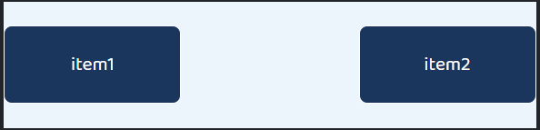
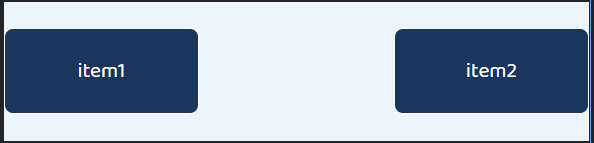
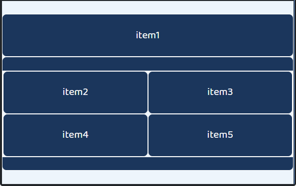
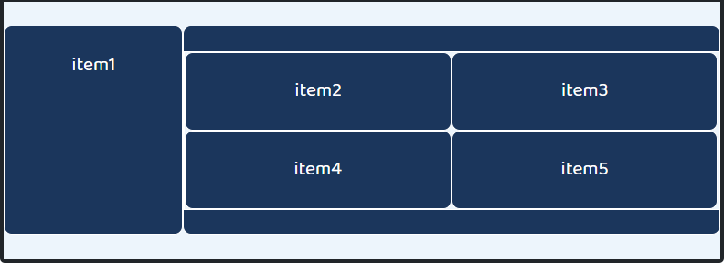
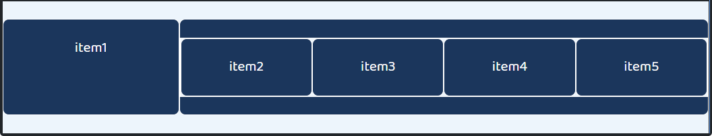

# Workshop 0204

> Grid System & Responsive Web

* Bootstrap Grid System
* Bootstrap Responsive Web
* Grid System의 활용
* Responsive Web의 이해


## 1. 기본 그리드 레이아웃

각 문항의 지시에 따라 01_grid.html 파일에 정답을 작성하시오.

1) 제시된 3개의 컬럼이 container를 가득 채우도록 클래스를 추가 작성하시오.

단, 각 컬럼의 너비는 동일하도록 작성하시오.

```html
<div class="row">
    <div class="item col-4">
        <p>4개</p>
    </div>
    <div class="item col-4">
        <p>4개</p>
    </div>
    <div class="item col-4">
        <p>4개</p>
    </div>
</div>
```


2) 제시된 2개의 컬럼이 container를 가득 채우도록 클래스를 변경하시오.

단, 각 컬럼의 너비는 동일하도록 작성하시오.

```html
<div class="row">
    <div class="item col-6">
        <p>6개</p>
    </div>
    <div class="item col-6">
        <p>6개</p>
    </div>   
</div>
```


3) 제시된 12개의 컬럼이 3칸, 6칸, 3칸씩 차지하도록 마크업과 클래스를 변경하시오.

```html
<div class="row">
    <div class="item col-3">
        <p>3개</p>
    </div>  
    <div class="item col-6">
        <p>6개</p>
    </div>
    <div class="item col-3">
        <p>3개</p>  
    </div>
</div> 
```


4) 제시된 3개의 컬럼이 2칸, 7칸, 3칸씩 차지하도록 클래스를 변경하시오.

```html
<div class="row">
    <div class="item col-2">
        <p>4개</p>
    </div>
    <div class="item col-7">
        <p>4개</p>
    </div>
    <div class="item col-3">
        <p>4개</p>
    </div> 
</div>
```


## 2. 반응형 그리드

각 문항의 지시에 따라 02_grid.html 파일에 정답을 작성하시오.

1) Viewport 너비가 576px 미만인 경우, 각 컬럼이 4칸, 4칸, 4칸씩 차지하고 576px 이상인 경우, 2칸, 5칸, 5칸씩 차지하도록 클래스를 추가하시오.

```html
<div class="row">
    <div class="item col-4 col-sm-2">
        <p>576px 미만 4 <br> 576px 이상 2</p>
    </div>
    <div class="item col-4 col-sm-5">
        <p>576px 미만 4 <br> 576px 이상 5</p>
    </div>
    <div class="item col-4 col-sm-5">
        <p>576px 미만 4 <br> 576px 이상 5</p>
    </div>
</div>
```


2) Viewport 너비가 768px 미만인 경우, 각 컬럼이 1칸, 3칸, 4칸, 1칸, 3칸씩 차지하고 768px 이상인 경우, 2칸, 3칸, 3칸, 2칸, 2칸씩 차지하도록 클래스를 추가하시오.

```html
<div class="row">
    <div class="item col-1 col-md-2">
        <p>768px 미만 1 <br> 768px 이상 2</p>
    </div>
    <div class="item col-3 col-md-3">
        <p>768px 미만 3 <br> 768px 이상 3</p>
    </div>
    <div class="item col-4 col-md-3">
        <p>768px 미만 4 <br> 768px 이상 3</p>
    </div>
    <div class="item col-1 col-md-2">
        <p>768px 미만 1 <br> 768px 이상 2</p>
    </div>
    <div class="item col-3 col-md-2">
        <p>768px 미만 3 <br> 768px 이상 2</p>
    </div>
</div>
```


3) Viewport 너비가 576px 미만인 경우, 각 컬럼이 4칸, 6칸, 2칸씩 차지하고 576px 이상인 경우, 3칸, 3칸, 6칸씩 차지하며 768px 이상인 경우, 6칸, 6칸, 12칸을 차지하도록 클래스를 추가하시오.

```html
<div class="row">
    <div class="item col-4 col-sm-3 col-md-6">
        <p>576px 미만 4 <br> 768px 미만 3 <br> 768px 이상 6</p>
    </div>
    <div class="item col-6 col-sm-3 col-md-6">
        <p>576px 미만 6 <br> 768px 미만 3 <br> 768px 이상 6</p>
    </div>
    <div class="item col-2 col-sm-6 col-md-12">
        <p>576px 미만 2 <br> 768px 미만 6 <br> 768px 이상 12</p>
    </div>
</div>
```


4) Viewport 너비가 768px 미만인, 경우 각 컬럼이 12칸, 12칸, 12칸씩 차지하고 768px 이상인 경우, 4칸, 4칸. 4칸씩 차지하며 1200px 이상인 경우, 2칸, 2칸씩 차지하고 12칸을 차지하는 컬럼이 그 다음에 내려오도록 클래스를 추가하시오.

```html
<div class="row">
    <div class="item col-12 col-md-4 col-xl-2">
        <p>768px 미만 12 <br> 768px 이상 4 <br> 1200px 이상 2</p>
    </div>
    <div class="item col-12 col-md-4 col-xl-2">
        <p>768px 미만 12 <br> 768px 이상 4 <br> 1200px 이상 2</p>
    </div>
    <div class="item col-12 col-md-4 col-xl-12">
        <p>768px 미만 12 <br> 768px 이상 4 <br> 1200px 이상 12</p>
    </div>
</div>
```


## 3. 그리드 심화

각 문항의 지시에 따라 03_grid.html 파일에 정답을 작성하되 offset 클래스를 적절한 상황에 사용하여 작성하시오.


1) Viewport가 768px 미만인 경우, 각 컬럼이 4칸, 8칸씩 차지하도록 하고, 768px 이상인 경우, 각 컬럼이 4칸, 4칸을 양 끝에서 차지하며 가운데 4칸의 빈 공간이 생기도록 클래스를 추가하시오.




```html
<div class="row justify-content-between">
    <div class="item col-4 col-md-4">
        <p>item1</p>
    </div>
    <div class="item col-8 col-md-4">
        <p>item2</p>
    </div>
</div>
```


2) Viewport가 768px 미만인 경우, 각 컬럼이 4칸, 4칸을 양 끝에서 차지하며 가운데 4칸의 빈 공간이 생기도록 하고, 992px 미만인 경우, 4칸의 빈 공간이 앞에 있고 4칸, 4칸의 컬럼이 뒤쪽에 위치하며 992px 이상인 경우, 앞에 7칸의 빈 공간이 있고 뒤에 5칸의 공간을 차지하는 컬럼과 그 아래 줄에 앞뒤 2칸의 빈 공간 사이에 8 칸을 차지하는 컬럼이 위치하도록 클래스를 추가하시오.




```html
<div class="row">
    <div class="item col-4 offset-md-4 col-lg-5 offset-lg-7">
        <p>item1</p>
    </div>
    <div class="item col-4 offset-4 col-md-4 offset-md-0 col-lg-8 offset-lg-2">
        <p>item2</p>
    </div>
</div>
```


3) 주어진 조건에 부합하도록 코드를 작성하시오.


Viewport 너비가 768px 미만인 경우, item1은 12칸을 차지하도록 하고 4개의 item을 감싸고 있는 박스는 12칸, 박스 내부의 item2, item3, item4, item5는 박스 너비를 12칸으로 보았을 때 각각 6칸씩 차지하도록 작성하시오.




Viewport 너비가 768px 이상 992px 미만인 경우, item1은 3칸을 차지하도록 하고 4개의 item을 감싸고 있는 박스는 9칸, 박스 내부의 item2, item3, item4, item5는 박스 너비를 12칸으로 보았을 때 각각 6칸씩 차지하도록 작성하시오.




Viewport 너비가 992px 이상인 경우, item1은 3칸을 차지하도록 하고 4개의 item을 감싸고 있는 박스는 9칸, 박스 내부의 item2, item3, item4, item5는 박스 너비를 12칸으로 보았을 때 각각 3칸씩 차지하도록 작성하시오.



```html
<div class="row">
    <div class="item col-12 col-md-3 col-lg-3">
        item1
    </div>
    <div class="item col-12 col-md-9 col-lg-9">
        <div class="row">
            <div class="item col-6 col-md-6 col-lg-3">item2</div>
            <div class="item col-6 col-md-6 col-lg-3">item3</div>
            <div class="item col-6 col-md-6 col-lg-3">item4</div>
            <div class="item col-6 col-md-6 col-lg-3">item5</div>
        </div>
    </div>
</div>
```

