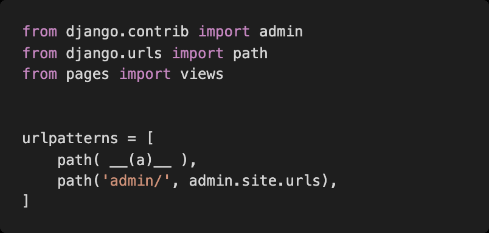

# Homework 0309

> Django Web Framework

* Django
* Django Template Language
* HTML form tag


## 1. 한국어로 번역하기


1-1. django 프로젝트를 한국어로 제공하기 위해 번역이 필요하다 이 설정을 위해 settings.py 에 어떤 변수 그리고 어떤 값을 할당해야 하는지 작성하시오.

```python
LANGUAGE_CODE = 'ko-kr'
```


1-2. 추가로 settings.py 에 '이 변수' 가 활성화인 상태여야 1-1 번 변수를 설정할 수 있다고 한다 . '이 변수' 는 무엇인가?

```PYTHON
USE_I18N
```


## 2. 경로 설정하기

다음은 어떤 django 프로젝트의 urls.py의 모습이다. 주소'/ssafy'로 요청이 들어왔을 때 실행되는 함수가 pages 앱의 views.py 파일 안 ssafy 함수라면, 요청에 응답하기 위해 빈칸 __(a)__에 추가되어야 할 코드를 작성하시오.




```django
path('ssafy/', views.ssafy)
```


## 3. Django Template Language

아래 링크를 참고하여 각 문제들을 해결하기 위한 코드를 작성하시오.

https://docs.djangoproject.com/en/3.1/ref/templates/builtins/


menus 리스트를 반복문으로 출력하시오.


```django
menu
```


posts 리스트를 반복문을 활용하여 0번 글부터 출력하시오.


```django
forloop.counter0
```


users 리스트가 비어있다면 현재 가입한 유저가 없습니다. 텍스트를 출력하시오.


```django
empty
```


첫 번째 반복문일 때와 아닐 때를 조건문으로 분기처리 하시오.


```django
if

else
```


출력된 결과가 주석과 같아지도록 하시오.


```django
length

title
```


변수 today에 datetime 객체가 들어있을 때 출력된 결과가 주석과 같아지도록 하시오.


```django
{{ today|date:"Y년 m월 d일 (D) A h:i"}}


```


## 4. Form tag with Django

다음은 form tag에 관한 문제이다. 올바른 답을 작성하시오.


지문의 코드 중 form 태그의 속성인 action의 역할에 대해 설명하시오.


```
form에서 사용자에게 데이터를 받을건데 전송할 데이터가 도착할 곳을 명시해준다.
```


지문의 코드 중 method가 가질 수 있는 속성 값을 작성하시오.


```
디폴트 값이 get
그리고 post
```


input 태그에 각각 '안녕하세요', '반값습니다', '파이팅' 문자열을 넣고 submit 버튼을 눌렀을 때 이동하는 url 경로를 작성하시오.


```
서버주소/create?title=안녕하세요&content=반갑습니다&my-site=
```


