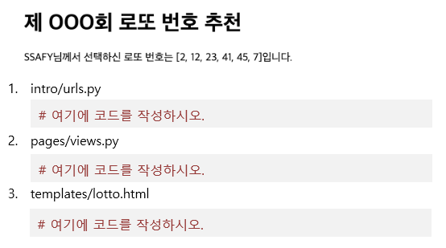

# Workshop 0309

> Django Web Framework


* Django Web Framework에 대한 이해
* 서버의 요청 처리 방식에 대한 이해
* Django를 통한 기본적인 서버 요청 처리의 이해


## 1. Django Project

아래 제시된 정보를 참고하여 사용자가 /lotto로 요청을 보냈을 때, 로또 번호 6개를 무작위로 추천하여 보여주는 페이지를 만드시오.


intro/는 startproject 명령어로 생성되는 project 디렉토리이다.

pages/는 startapp 명령어로 생성되는 application 디렉토리이다.

```
intro/
    __init__.py
    settings.py
    urls.py
    wsgi.py
pages/
    migrations/
    templates/
    lotto.html
    __init__.py
    admin.py
    apps.py
    models.py
    test.py
    views.py
manage.py
```


## 2. 작성해야 하는 파일 정보


1) intro/urls.py

​	lotto/ 형태의 요청 경로가 명시되는 파일


2) pages/views.py

​	무작위 로또 번호를 생성하고 html 파일을 렌더링 해주는 함수가 작성되는 파일


3) templates/lotto.html

​	서버의 응답 결과로 로또 번호 6개를 사용자에게 보여주는 html 문서


## 3. 결과 예시

1) 아래와 같은 양식으로 결과 사진과 views.py, urls.py, lotto.html 파일의 코드를 별도의 마크다운 파일에 작성하여 제출하시오.




## 결과


1. intro/urls.py

   ```django
   urlpatterns = [
       path('admin/', admin.site.urls),
       path('pages/', include('pages.urls')),
   ]
   ```

   

2. pages/views.py

   ```django
   import random
   # Create your views here.
   def lotto(request):
       numbers = random.sample(range(1,46),6)
       context = {
           'numbers': numbers,
       }
       return render(request, 'pages/lotto.html', context)
   ```

   

3. templates/lotto.html

   ```django
   <h1>제 OOO회 로또 번호 추천</h1>
     <p>SSAFY님께서 선택하신 로또 번호는 {{ numbers }}입니다.</p>
   ```

   


## 설명

1.  django-admin startproject intro - 프로젝트 생성
2.  cd intro/ - intro 내부 접근
3. python manage.py startapp pages - pages 라는 앱 생성
4. setting 에 앱 등록하기 'pages' 및 언어 시간대 등록하기
5. url 분리
   1. urls 들어가서 pages에서 받을수 있게 만들어줌 include 포함
6.  pages 내에 url 만들어서 받을수 있게 해줌
7. views 에서 로또 함수 생성
8. templates/pages 생성해서 안에 lotto html 만들어줌

