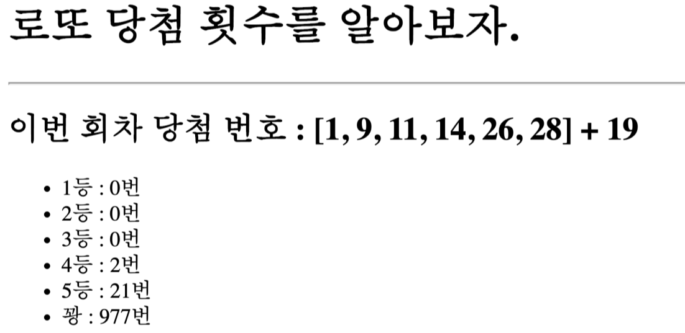
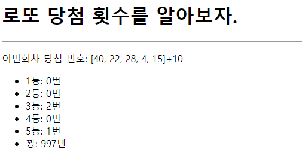

# Pracitce 0309

> Django Web Framework


* Django Web Framework
* 3rd Party Library
* Django Template Language
* Open API 와 3rd Party Library 의 활용


## Django Project

아래 제시된 정보를 참고하여 사용자가 /lotto/로 요청을 보냈을 때, 로또 당첨번호와 보너스 번호, 1000회 분량의 무작위 로또 추첨 결과를 보여주는 페이지를 만드시오.


1) practice/ 는 startproject 명령어로 생성되는 project 디렉토리이다

2) pages/ 는 startapp 명령어로 생성되는 application 디렉토리이다


## 작성해야 하는 파일 정보

1) pages/urls.py 

​	lotto/ 형태의 요청 경로가 명시되는 파일

2) pages/views.py 

​	이번 회차 로또 당첨 번호와 보너스 번호를 받아와 무작위로 생성한 1000회 분량의 로또 번호를 비	교하고, 각 등수 별 당첨 횟수를 기록하여 lotto.html을 렌더링 할 때 해당 값들을 넘겨주는 함수가 	작성된 파일

3) templates/pages/lotto.html 

​	views.py에서 넘어온 데이터 출력하는 html 파일.


## 결과 예시


1) 아래와 같은 양식으로 결과 사진과 views.py, urls.py, lotto.html 파일의 코드를 별도의 마크다운 파일에 작성하여 제출하시오.




## 결과



### views.py

```python
from django.shortcuts import render
import random
import requests
# Create your views here.

def lotto(request):
    # url을 받아와서 지정해주었다.
    url = 'https://www.dhlottery.co.kr/common.do?method=getLottoNumber&drwNo=953'
    # 해당 url에 요청
    res = requests.get(url)
    # 요청한것을 딕셔너리 형태로
    win_info = res.json()
    # 당첨번호 초기화
    winning_number = []
    # 키밸류 값으로 반복
    for k,v in win_info.items():
        # 순서 구분을 위해서 당첨 번호 먼저 받아오기
        # 그냥 해당 글자가 들어가면 당첨번호니까 그원리 이용
        if 'drwtNo' in k:
            winning_number.append(v)
    # 마지막으로 보너스 넘버 받아오기
    bnus_number = win_info.get('bnusNo')
    

    # 등수들 초기화
    fifth = 0
    fourth = 0
    third = 0
    second = 0
    first = 0
    boom = 0

    for _ in range(1000):
        numbers = random.sample(range(1,46),6)
        # 카운트 변수 초기화
        cnt = 0
        for i in range(len(numbers)):
            if numbers[i] in winning_number:
                cnt += 1

        if cnt == 3:
            fifth += 1
        elif cnt == 4:
            fourth += 1
        elif cnt == 5:
            if bnus_number in numbers:
                second += 1
            else:
                third += 1
        elif cnt == 6:
            first += 1 
        else:
            boom += 1

    # 다 실행한 후에 context로 넘겨주기
    context = {
    'fifth':fifth,
    'fourth': fourth,
    'third': third, 
    'second': second,
    'first': first,
    'boom': boom,
    'winning_number': winning_number,
    'bnus_number': bnus_number,
    }

    return render(request, 'pages/lotto.html', context)

```


### urls.py

```python
from django.urls import path
from . import views

urlpatterns = [
    path('lotto/', views.lotto, name='lotto')
]

```


### lotto.html

```django
<!DOCTYPE html>
<html lang="en">
<head>
  <meta charset="UTF-8">
  <meta http-equiv="X-UA-Compatible" content="IE=edge">
  <meta name="viewport" content="width=device-width, initial-scale=1.0">
  <title>Document</title>
</head>
<body>
  <h1>로또 당첨 횟수를 알아보자.</h1>
  <hr>
  <p>이번회차 당첨 번호: {{ dr_number }}+{{ bn_number }}</p>

  <ul>
    <li>1등: {{ first }}번</li>
    <li>2등: {{ second }}번</li>
    <li>3등: {{ third }}번</li>
    <li>4등: {{ fourth }}번</li>
    <li>5등: {{ fifth }}번</li>
    <li>꽝: {{ boom }}번</li>
  </ul>
</body>
</html>
```

