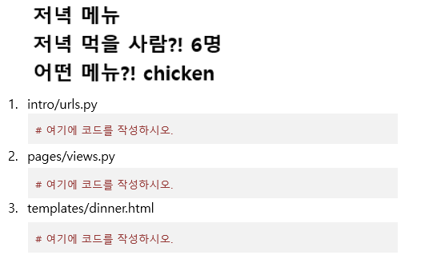
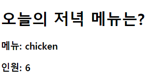

# Workshop 0309

> Django Web Framework


* Variable Routing
* Variable Routing에 대한 이해


## Django Project

아래 제시된 정보를 참고하여 사용자가 / 저녁메뉴 인원수 로 요청을 보냈을 때 , URL 을 통해 넘긴 값을html 에서 보여주는 페이지를 만드시오

1) intro/ 는 startproject 명령어로 생성되는 project 디렉토리이다

2) pages/ 는 startapp 명령어로 생성되는 application 디렉토리이다

```
intro/
    __init__ py
    settings.py
    urls.py
    wsgi.py
pages/
    migrations/
    templates/
    	dinner.html
    __init__. py
    admin.py
    apps.py
    models.py
    test.py
    views.py
manage.py
```


## 작성해야 하는 파일 정보

1)  intro/urls.py

​	dinner/< 저녁메뉴 인원수 >/ 형태의 요청 경로가 명시되는 파일


2) Variable Routing 의 개념을 활용한다

​	저녁메뉴는 string, 인원수는 integer 이다


3) pages/views.py

​	Variable Routing 을 통해 전달 받은 인자를 html 파일에서 사용할 수 있도록 렌더링 할 때 넘겨준	다


4) templates/dinner.html

​	html 마크업이 작성된 문서이다 

​	views.py 에서 넘어온 데이터가 해당 문서에서 출력된다


## 결과 예시

1) 아래와 같은 양식으로 결과 사진과 views.py, urls.py, dinner.html 파일의 코드를 별도의 마크다운 파일에 작성하여 제출하시오




## 결과



1. intro/pages/urls.py

   ```python
   from django.urls import path
   from . import views
   
   app_name = 'pages'
   urlpatterns = [
       path('dinner/<str:menu>/<int:people>/', views.dinner, name='dinner')
   ]
   ```

   

2. pages/views.py

   ```python
   from django.shortcuts import render
   
   # Create your views here.
   
   def dinner(request, menu, people):
       context = {
           'menu': menu,
           'people': people
       }
       return render(request, 'pages/dinner.html', context)
   ```

   

3. templates/dinner.html

   ```django
   <!DOCTYPE html>
   <html lang="en">
   <head>
     <meta charset="UTF-8">
     <meta http-equiv="X-UA-Compatible" content="IE=edge">
     <meta name="viewport" content="width=device-width, initial-scale=1.0">
     <title>저녁 메뉴</title>
   </head>
   <body>
     <h1>오늘의 저녁 메뉴는?</h1>
     <h3>메뉴: {{ menu }}</h3>
     <h3>인원: {{ people }}</h3>
     
   </body>
   </html>
   ```

   