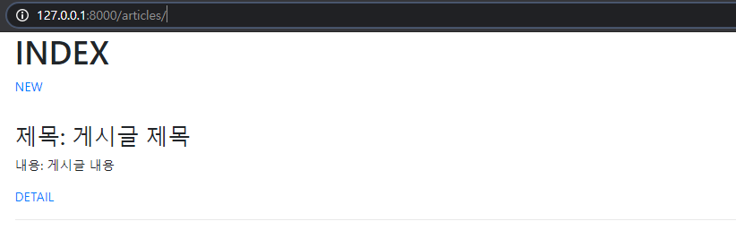
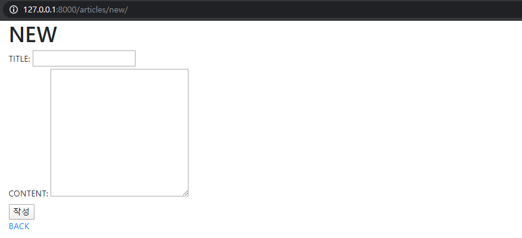
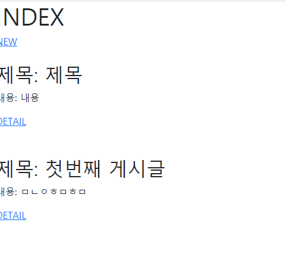
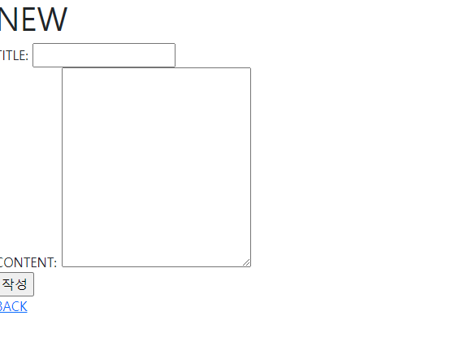

# Workshop 0310

> Model

* Web Framework
* Django Model
* Django CR

## Article CR

CR을 갖춘 장고 프로젝트를 제작하고 결과 사진과 코드를 별도의 마크다운 파일에 작성하여 제출하시오

## 기본설정

1) 프로젝트 이름은 crud, 앱 이름은 articles 로 설정한다

2) 모든 템플릿에서 상속받아 사용할 base.html 을 작성한다. base.html 이 담긴 templates 디렉토리는 프로젝트 및 앱 디렉토리와 동일한 위치에 생성한다. base.html 은 Bootstrap CDN 을 포함하고 있어야 한다 .

## CR 구현

제시된 결과 사진들을 참고하여 장고 프로젝트를 진행하시오.

1. Read

   

2. Create

   

## 결과

