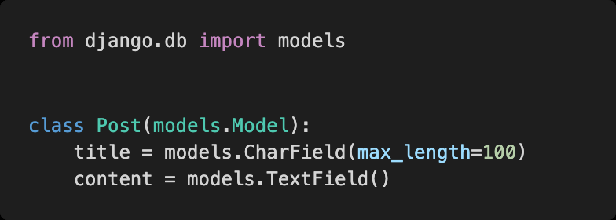
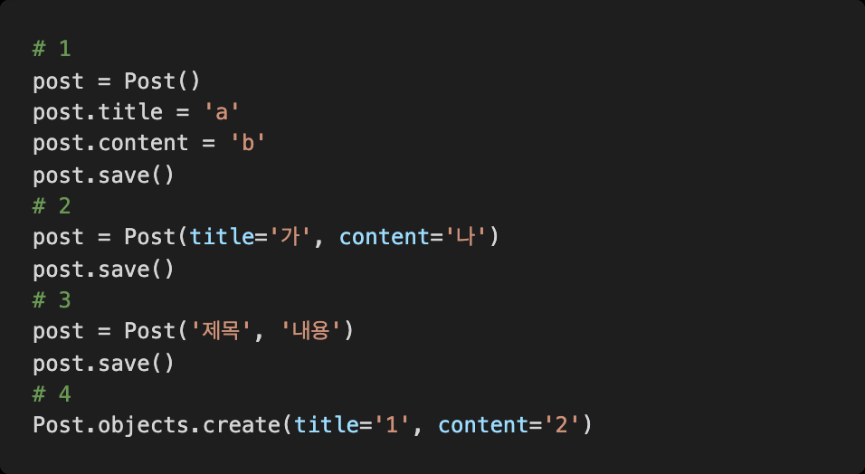
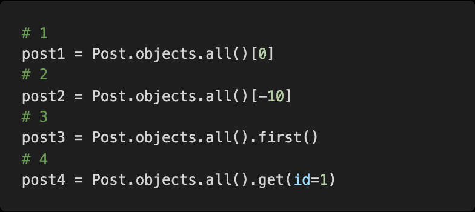
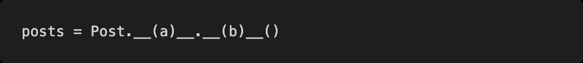

# Homework 0311

> Model


* Django model


## Django Model

posts앱 안의 model.py 파일에 다음과 같은 코드를 작성하였다.




1) models.py를 작성한 후 마이그레이션 작업을 위해 터미널에 작성해야 하는 두 개의 명령어를 작성하시오.


``` bash
$ python manage.py makemigrations
```

```bash
$ python manage.py migrate
```


2) 다음 중 새로운 Post를 저장하기 위하여 작성한 코드 중 옳지 않은 것을 고르시오.




```
# 3. Post클래스에 arguments자리에는 상속시키는 것이 들어가야한다.
```


3) Post가 10개 저장되어 있고 id의 값이 1부터 10까지라고 가정할 때 가장 첫 번째 Post를 가져오려고 한다. 다음 중 옳지 않은 코드를 고르시오.




```
# 2 post2 = Post.objects.all()[-10]
```


4) my_post 변수에 Post 객체 하나가 저장되어 있다. title을 "안녕하세요" content를 "반갑습니다"로 수정하기 위한 코드를 작성하시오.


```python
my_post = Post()
my_post.title = '안녕하세요'
my_post.content = '반갑습니다.'
```


5) 만들어진 모든 Post 객체를 QuerySet형태로 반환 해주기 위해 빈칸에 들어갈 코드를 작성하시오.




```
(a) objects

(b) values
```

