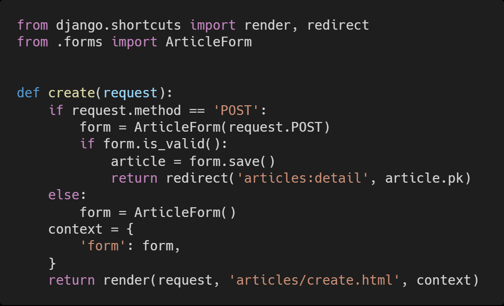

# Homework 0316

> Form


* Django Web Framework
* Django view structure
* Django Modelform View structure의 이해


## Problem

아래 작성된 views.py의 코드 일부를 보고 문제에 알맞은 답을 서술하시오.




1) 왜 변수 context는 if else 구문과 동일한 레벨에 작성 되어있는가?

```
if 와 else문 어떤 요청이 와도 form을 사용할 수 있도록 하기 위해서 
(if 에서는 유효성 검사에서 return 되지않았을경우)
```


2) 왜 request의 http method는 POST 먼저 확인하도록 작성하는가?

```
GET보다 더 큰 범주가 POST라서?
```

