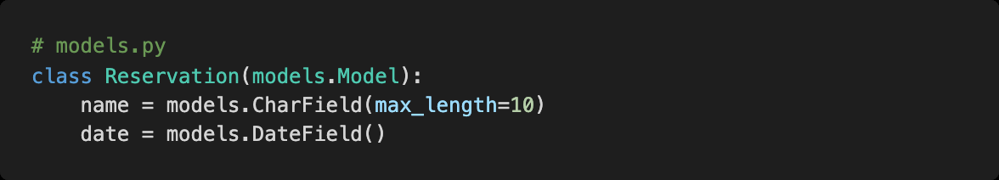
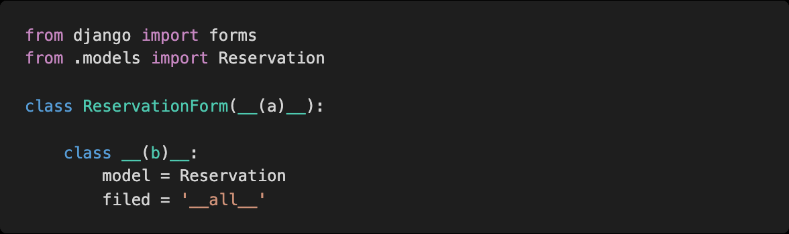
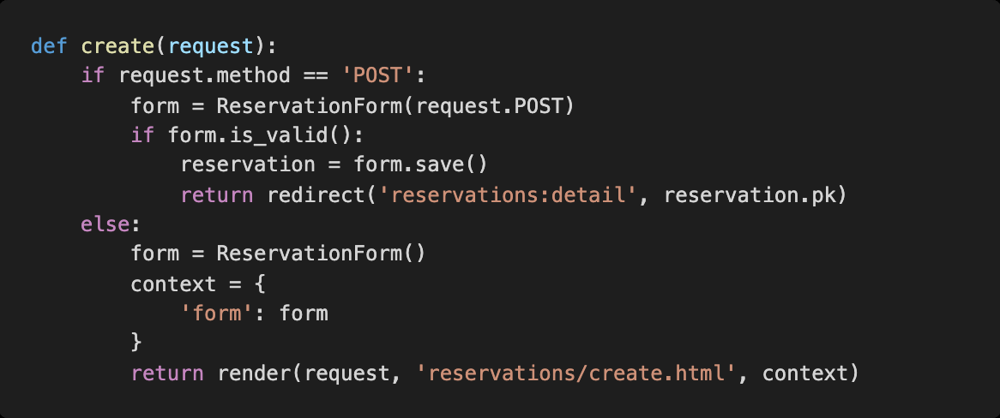
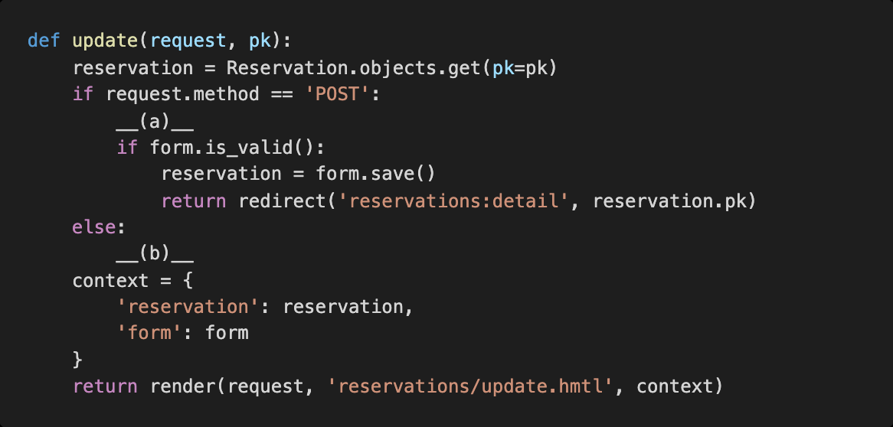
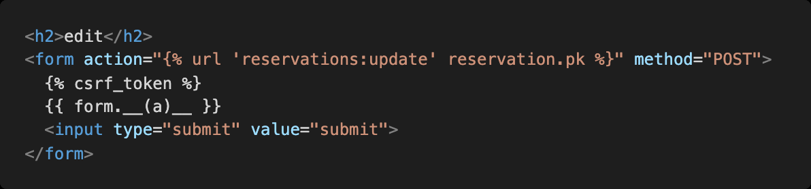

# Workshop 0316

> Form


* Django Model Form


## Django Model Form

아래의 코드들을 참고하여 각 문항에 답하시오.




1)  모델 폼을 정의하기 위해 빈칸에 들어갈 코드를 작성하시오.



```
(a) forms.ModelForm

(b) Meta
```


2) 글 작성 기능을 구현하기 위해 다음과 같이 코드를 작성하였다. 서버를 실행시킨 후 기능을 테스트 해보니 특정 상황에서 문제가 발생하였다. 이유와 해결 방법을 작성하시오.



```
POST 요청을 받았을때, 즉 값이 있을때 context가 작동하지 않아서 form을 사용할 수 없다.

context = {
	'form': form
}
부터 return까지 else문 밖으로 이동한다.
```


3) 글 수정 기능을 구현하기 위해 빈칸에 들어갈 코드를 작성하시오.



```
(a) form = ReservationForm(request.POST, instance=reservation)

(b) form = ReservationForm(instance=reservation)
```


4) 글 수정 기능을 구현하기 위해 빈칸에 들어갈 수 있는 코드를 모두 작성하시오.



```
(a)

as_p
as_ul
as_table

```

