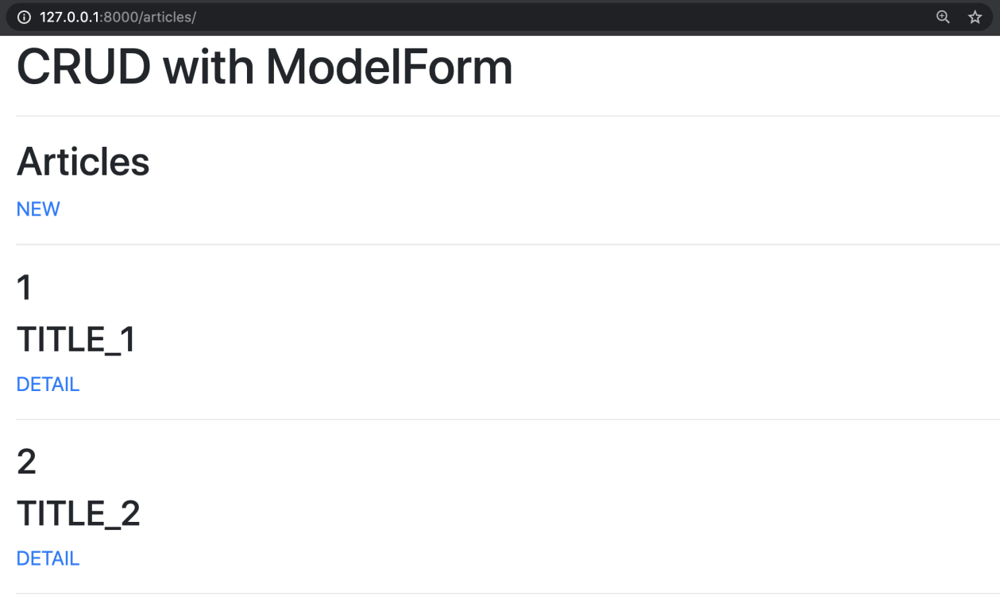
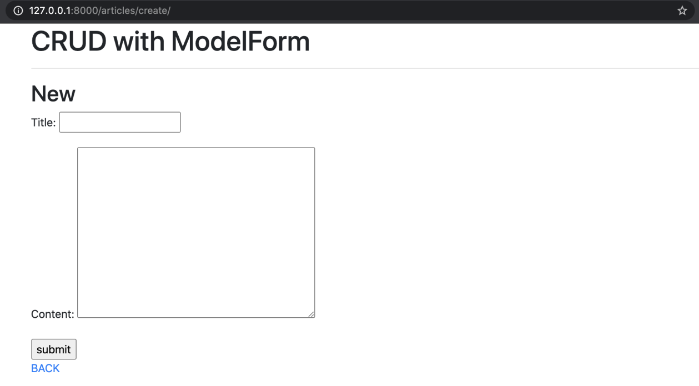
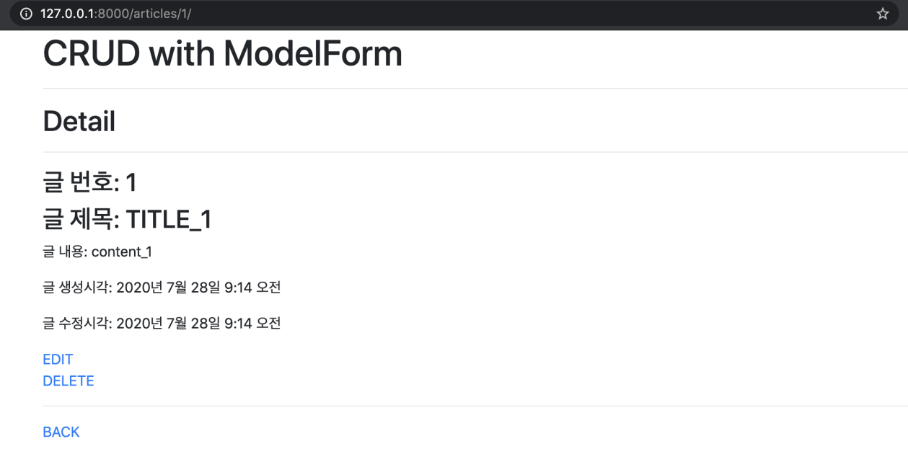
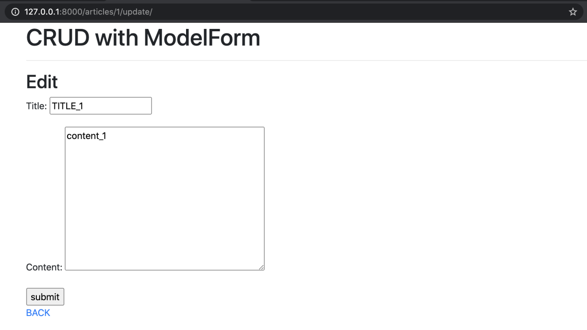
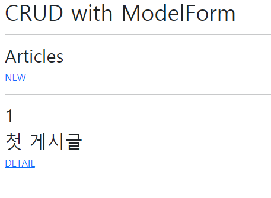
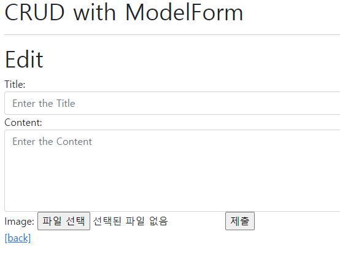
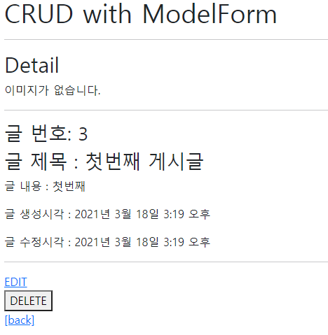
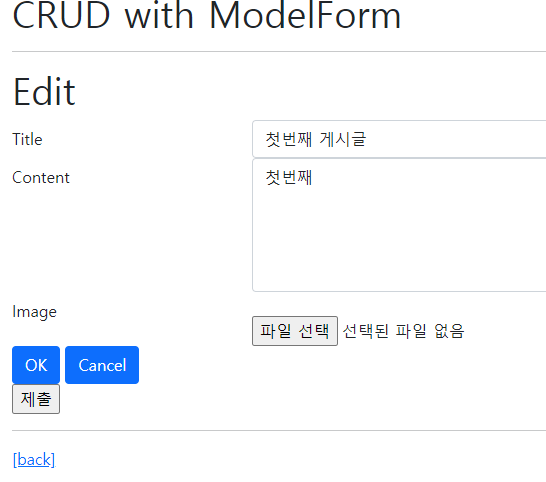

# Workshop 0318

> Form & Static/Media


* Web Framework
* Django
* Django ModelForm


## Django Project

Django Model Form을 활용해 CRUD를 모두 갖춘 장고 프로젝트를 제작하고 결과 사진과 코드를 별도의 마크다운 파일에 작성하여 제출하시오.


## 기본설정

1. 프로젝트 이름은 crud, 앱 이름은 articles로 설정한다.

2. 모든 템플릿에서 상속받아 사용할 base.html을 작성한다.

   base.html이 담긴 templates 디렉토리는 프로젝트 및 앱 디렉토리와 동일한 위치에 생성한다.

   base.html은 Bootstrap CDN을 포함하고 있어야 한다.


## CRUD 구현

제시된 결과 사진들을 참고하여 장고 프로젝트를 진행하시오.

1) Read



2) Create




3) Detail




4) Update




5) Delete

 별도 페이지 없음


## 결과











### urls


```python
from django.urls import path
from . import views

app_name = 'articles'

urlpatterns = [
    path('', views.index, name='index'),
    path('create/', views.create, name='create'),
    path('<int:pk>/', views.detail, name='detail'),
    path('<int:pk>/delete/', views.delete, name='delete'),
    path('<int:pk>/update/', views.update, name='update'),
    
]

```


### views

```python
from django.shortcuts import render, redirect
from django.views.decorators.http import require_safe, require_http_methods, require_POST
from .models import Article
from .forms import ArticleForm
# Create your views here.

@require_safe
def index(request):
    # 모든 게시글을 거꾸로 조회

    articles = Article.objects.order_by('-pk')
    context = {
        'articles': articles,
    }
    return render(request, 'articles/index.html', context)


@require_http_methods(['GET', 'POST'])
def create(request):
    # POST일 때
    if request.method == 'POST':
        form = ArticleForm(request.POST, request.FILES)
        if form.is_valid():
            article = form.save()
            return redirect('articles:detail', article.pk)
    # GET일 때
    else:
        form = ArticleForm()
    context = {
        # 상황에 따른 2가지 모습
        # 1. is_valid에서 내려온 form : 에러메세지를 포함한 form
        # 2. else에서 내려온 form : 빈 form
        'form': form,
    }
    return render(request, 'articles/create.html', context)

@require_safe
def detail(request, pk):
    # 몇번 글을 조회할건지 가져와야 함
    article = Article.objects.get(pk=pk)
    context = {
        'article': article,
    }
    return render(request, 'articles/detail.html', context)


@require_POST
def delete(request, pk):
    # 삭제할 게시글 조회
    article = Article.objects.get(pk=pk)
    # 삭제 요청이 POST면 삭제, POST가 아니라면 DETAIL 페이지로 redirect
    article.delete()
    return redirect('articles:index')


@require_http_methods(['GET', 'POST'])
def update(request, pk):
    article = Article.objects.get(pk=pk)
    # update
    if request.method == 'POST':
        form = ArticleForm(request.POST, request.FILES, instance=article)
        if form.is_valid():
            form.save()
            return redirect('articles:detail', article.pk)
    # edit
    else:
        form = ArticleForm(instance=article)
    context = {
        'form': form,
        'article': article,
    }
    return render(request, 'articles/update.html', context)
```


### index

```django




  

  <h2>Articles</h2>
  <a href="">NEW</a>
  <hr>
  
    <h2>{{ article.pk }}</h2>
    <h2>{{ article.title }}</h2>
    <a href="">DETAIL</a>
    <hr>
  


```


### create

```django



  <h1>New</h1>

  <form action="" method="POST">
    
    
      
        
          <div class="alert alert-warning" role="alert"><strong>{{ error|escape }}</strong></div>
        
      
      {{ field.label_tag }}
      {{ field }}
    
    <input type="submit">
  </form>

  <a href="">[back]</a>


```


```django



  <h2>Detail</h2>
  
    
  
    <p>이미지가 없습니다.</p>
  
  
  <hr>
  <h3>글 번호: {{ article.pk }}</h3>
  <h3>글 제목 : {{ article.title }}</h3>
  <p>글 내용 : {{ article.content }}</p>
  <p>글 생성시각 : {{ article.created_at }}</p>
  <p>글 수정시각 : {{ article.updated_at }}</p>
  <hr>
  <a href="">EDIT</a>
  
  <form action="" method="POST">
    
    <button>DELETE</button>
  </form>
  <a href="">[back]</a>


```


### update


```django




  <h1>Edit</h1>
  <form action="" method="POST" enctype="multipart/form-data">
    

    
    


    <input type="submit">
  </form>
  <hr>
  <a href="">[back]</a>


```


아직스스로 하기 힘들어서 중간에 수업 코드를 따라해가며 원리를 파악했다...

