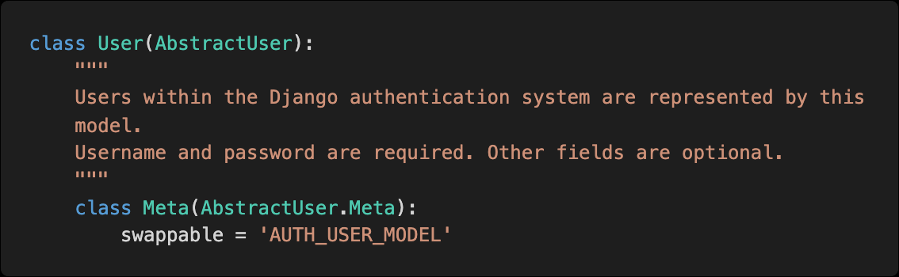
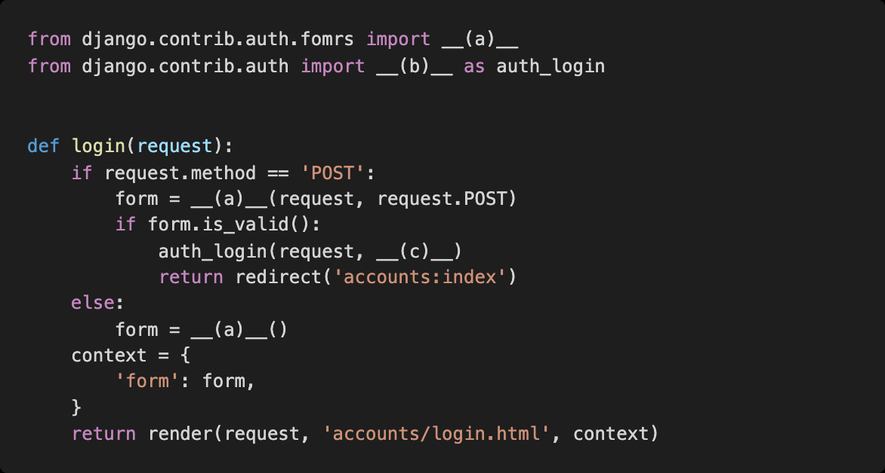

# Homework 0323

> Django Authentication System


* Django Accounts


## 1. User Model BooleanField

django에서 기본적으로 사용하는 User 모델은 AbstractUser 모델을 상속받아 정의된다.



아래의 models.py를 참고하여 User 모델에서 사용할 수 있는 칼럼 중 BooleanField로 정의 된 컬럼을 모두 작성하시오.
https://github.com/django/django/blob/master/django/contrib/auth/models.py


```
is_staff

is_active

is_superuser
```


## 2. username max length

django에서 기본적으로 사용하는 User 모델의 username 컬럼이 저장할 수 있는 최대 길이를 작성하시오.


```
150 - (150 characters or fewer)이라고 되어있음
```


## 3. login validation

단순히 사용자가 '로그인 된 사용자인지’만을 확인하기 위하여 User 모델 내부에 정의된 속성의 이름을 작성하시오.


```
is_authenticated
```


## 4. Login 기능 구현

다음은 로그인 기능을 구현한 코드이다 . 빈 칸에 들어갈 코드를 작성하시오




```
(a) AuthenticationForm

(b) login

(c) user

```


## 5. who are you?

로그인을 하지 않았을 경우 template 에서 user 변수를 출력했을 때 나오는 클래스의 이름을 작성하시오


## 6. 암호화 알고리즘

Django에서 기본적으로 User 객체의 password 저장에 사용하는 알고리즘 그리고 함께 사용된 해시 함수를 작성하시오


```
update_session_auth_hash()
```


## 7. Logout 기능 구현

로그아웃 기능을 구현하기 위하여 다음과 같이 코드를 작성하였다 . 로그아웃 기능을 실행 시 문제가 발생한다고 할 때 그 이유와 해결 방법을 작성하시오


```
함수의 이름과 안에서 실행시키는 함수의 이름이 같다.
하지만 우리가 원하는 것은 로그아웃을 시켜주는 기존 내장된함수를 원하기 때문에 둘중에 하나의 이름을 바꿔주어야한다.
그래야 두개가 따로 작동한다.
import as를 이용하여 사용하여 준다.
내부의 logout을 auth_logout으로 바꿔준다
```

