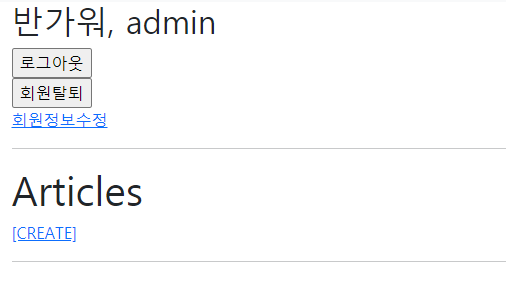

# Practice 0323

> Django Authentication System


* Web Framework
* Django Authentication
* User CRUD
* Login and Logout


## 1. User Create

/accounts/signup/

회원가입 기능을 구현한다.


## 2. Login

/accounts/login

로그인 기능을 구현한다.

* 로그인을 한 경우, nav에 다음과 같은 정보가 표시된다.
  1. 로그인 한 유저 정보
  2. 로그아웃
  3. 회원 수정
  4. 회원 탈퇴


## 3. Logout

/accounts/logout/

로그아웃 기능을 구현한다.

* 로그아웃을 한 경우, nav에 다음과 같은 정보가 표시된다.
  1. 회원가입
  2. 로그인


## 4. User Update

/accounts/update/

회원 정보 수정 기능을 구현한다.

* 회원 정보 수정 페이지에서는 아래의 정보만 수정 할 수 있도록 설정한다.
  1. 이메일 주소
  2. 이름, 성


## 5. User Delete

/accounts/delete/

회원 삭제 기능을 구현한다.

* 단, POST method 일 때만 삭제할 수 있도록 작성한다.


## 제출방법

views.py에 작성한 코드와 각 페이지의 결과 사진을 마크다운에 작성하여 제출한다.


## 결과


```python
from django.shortcuts import render, redirect

# 로그인, 로그아웃 함수 불러오기
from django.contrib.auth import login as auth_login, logout as auth_logout, update_session_auth_hash

# 로그인 폼 불러오기
from django.contrib.auth.forms import AuthenticationForm, UserCreationForm, UserChangeForm, PasswordChangeForm

# 데코레이트 불러오기
from django.views.decorators.http import require_POST

from .forms import CustomUserChangeForm


# Create your views here.

def login(request):
    # 로그인이 되어있으면 로그인 로직에 접근할 수 없음
    if request.user.is_authenticated:
        return redirect('articles:index')

    if request.method == 'POST':
        # 사용자가 실제로 입력한 POST 데이터
        form = AuthenticationForm(request, request.POST)
        if form.is_valid():
            # AuthenticationForm은 request 객체를 받는다.
            # 로그인 폼은 모델폼 x - > save x
            # get_user() 유저 instace를 꺼내오는 것]
            # get_user() 메서드 제공 -> 인증이 끝난 유저 인스턴스를 반환
            # 단, form validation이 끝난 후 호출할 수 있음
            user = form.get_user()
            # user 인스턴스를 로그인 함수에 넘겨줌
            auth_login(request, user) # 세션을 CREATE

            # /accounts/login/?next=/articles/create/
            next_url = request.GET.get('next')
            return redirect(next_url or 'articles:index')

    else:
        # GET : 비어있는 로그인 폼 던져주기
        form = AuthenticationForm()
    
    # form 사용하기 위해 context 담아주기
    context = {
        'form': form,
    }
    return render(request, 'accounts/login.html', context)

@require_POST
def logout(request):
    auth_logout(request)
    return redirect('articles:index')


@require_POST
def delete(request):
    # 현재 세션을 유지하고 있는 User가 User Instance인 경우 (AnonymousUser는 delete 불가능)
    if request.user.is_authenticated:
        # User Instance를 Delete
        request.user.delete()
        auth_logout(request)
    return redirect('articles:index')

def signup(request):
    # 로그인한 사용자 생성 금지
    if request.user.is_authenticated:
        return redirect('articles:index')

    if request.method == 'POST':
        form = UserCreationForm(request.POST)
        if form.is_valid():
            user = form.save()
            auth_login(request, user)
            return redirect('articles:index')
    else:
        form = UserCreationForm()
    context = {
        'form': form,
    }
    return render(request, 'accounts/signup.html', context)


def update(request):
    if request.method == 'POST':
        form = CustomUserChangeForm(request.POST, instance=request.user)
        if form.is_valid():
            form.save()
            return redirect('articles:index')
    else:
        form = CustomUserChangeForm(instance=request.user)
    context = {
        'form': form,
    }
    return render(request, 'accounts/update.html', context)


def update_password(request):
    if request.method == 'POST':
        form = PasswordChangeForm(request.user, request.POST)
        if form.is_valid():
            user = form.save()
            update_session_auth_hash(request, user)
            return redirect('articles:index')
    else:
        form = PasswordChangeForm(request.user)
    context = {
        'form': form,
    }
    return render(request, 'accounts/update_password.html', context)
```




