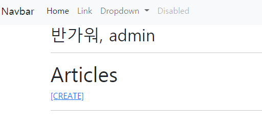

[toc]


# Practice 과정 메모

>참고할 사이트
>
>* django duth forms 검색해서 위에 두개 사이트 참고
>
>* django github auth forms 검색해서 원본 참고


## 가상환경실행

1. 가상환경 실행하기
2. 기존의 앱만들었떤걸 참고해서 사용
3. 기존의 앱은 유튜브 자료에 03_django_form 사용


## 앱등록 , url

1. 앱등록, 앱등록 이름은 accounts로 하는것이 좋다.

   * 장고개발자들이 accounts로 해놓은 이름이 많아서 편리하게 사용할 수 있음

   * ```bash
     $ python manage.py startapp accounts
     ```

   * 앱등록해주기( 앱순서 잘 생각해보기 )

2. url 설정해주기


## accounts/views.py - login 생성1


1. 먼저 기본적인 POST로 받을때와 GET으로 받을때로 나누어 준다.

   ​	( POST GET 차이 ? 알기)

   이를 위해서 import 해줘야할것

   ```python
   # 로그인 폼 불러오기
   from django.contrib.auth.forms import AuthenticationForm
   ```

   

```python
def login(request):
    if request.method == 'POST':
        pass
    else:
        # GET : 비어있는 로그인 폼 던져주기
        form = AuthenticationForm()
    
    # form 사용하기 위해 context 담아주기
    context = {
        'form': form,
    }
    return render(request, 'accounts/login.html', context)
```

AutheticationForm 은 username 과 password가 있음

## login.html

일반적인 형태로 작성

as_p 사용하여 로그인 폼 받아온것

```django



<h1>로그인</h1>
<hr>
<form action="" method="POST">
    
    {{ form.as_p }}
    <input type="submit">
</form>

```


## accounts/views.py - login 생성2

데이터를 받아오는 과정

로그인을 하기 위해 로그인 함수 불러오기

```python
# 로그인 함수 불러오기
from django.contrib.auth import login as auth_login
# redirect도 불러와주기
```


```python
if request.method == 'POST':
        # 사용자가 실제로 입력한 POST 데이터
        form = AuthenticationForm(request, request.POST)
        if form.is_valid():
            # AuthenticationForm은 request 객체를 받는다.
            # 로그인 폼은 모델폼 x - > save x
            # get_user() 유저 instace를 꺼내오는 것]
            # get_user() 메서드 제공 -> 인증이 끝난 유저 인스턴스를 반환
            # 단, form validation이 끝난 후 호출할 수 있음
            user = form.get_user()
            # user 인스턴스를 로그인 함수에 넘겨줌
            auth_login(request, user) # 세션을 CREATE

            return redirect('articles:index')
```

아직 계정생성을 만들지 않았기 때문에 계정을 생성하고 해보자

```bash
$ python manage.py createsuperuser
```

생성된 계정을 입력하면 성공적으로 시작페이지로 이동하는 것을 볼 수 있다.


장고는 쿠키가 아닌 데이터베이스에 세션을 저장한다.


## base.html 이름 보여주기

장고에서는 기본적으로 request에 대한 user 메서드를 제공해줌

request는 기본적으로 context되어있는 것 세팅에 teamplates 들어가보면 확인할 수 있다.

```django
<body>
  

  
  <div class="container">
    <h2>반가워, {{ request.user }}</h2>
    <hr>
    
    
  </div>
  
</body>
```




## accounts/views.py logout

먼저 로그아웃 모듈을 불러와 줘야하는데 다음과 같이 표현할 수 있다.

```python
from django.contrib.auth import login as auth_login, logout as auth_logout
```

```python
# 데코레이트 불러오기
from django.views.decorators.http import require_POST
```

불러운 함수를 사용하여 단순하게 로그아웃 가능

POST만 받는것 데코레이트 사용

```python
@require_POST
def logout(request):
    auth_logout(request)
    return redirect('aritcles:index')
```


## base.html

```django
<div class="container">
    <h2>반가워, {{ request.user }}</h2>
    <a href="">로그인</a>
    <form action="" method="POST">
      
      <input type="submit" value="로그아웃">
    </form>
    <hr>
    
    
  </div>
```

POST는 자동으로 form 형태 method 들어가는것 자동되야함 csrf도 마찬가지


이와 같은 과정을 거치면 비로그인 상태에서도 로그아웃이 보인다.

이를 해결해보자


if else 태그 사용

```django

      <form action="" method="POST">
        
        <input type="submit" value="로그아웃">
      </form>
    
      <a href="">로그인</a>
    
```

위 같은 과정을 통해 유저이면 로그아웃 버튼을

anonymoususer이면 로그인 버튼을


위와 같은 방법을 사용하면 버튼만 사라질 뿐이지 url로 접근 가능함

근본적으로는 view에대한 접근까지 확인하기


## accounts/views.py 접근제한

```python
def login(request):
    # 로그인이 되어있으면 로그인 로직에 접근할 수 없음
    if request.user.is_authenticated:
        return redirect('articles:index')
```

is_authenticated 속성이용

require_login 데코레이트 이용 하는 방법 두가지가 있음


## index.html - 새글 접근 수정

위에서 했던 것 처럼 버튼을 숨기고 그다음 접근을 제한 시켜주기

```django

    <a href="">[CREATE]</a>
  
    <a href="">[새글을 작성하려면 로그인 하세요.]</a>
  
```


## articles/views.py - 접근제한

먼저 데코레이터 불러오기

```python
# login 데코레이터 불러오기
from django.contrib.auth.decorators import login_required
```

```python
@login_required
@require_http_methods(['GET', 'POST'])
def create(request):
```

데코레이터는 두개 붙일 수 있음


create 뿐만 아니라 delete update 를 다들 데코레이터 붙여줌 


이렇게 제한해놓고 url로 접근하면 주소가 다르게 나온다

```
http://127.0.0.1:8000/accounts/login/?next=/articles/create/
```

페이지가 로그인으로 돌아오긴 했지만 next 이후의 파라미터 값을 붙여줬음

이는 사용자가 여기 오기전에 직전의 주소를 보내준 것임


## accounts/views.py 로그인 next 페이지


login html에 보면 

```django
action=""
```

때문에 무조건 로그인 페이지로 보내게됨 이것을 지워주자 

그렇다면 즉 생략된다면 현재위치한 url 주소로 간다.


```python
# /accounts/login/?next=/articles/create/
            next_url = request.GET.get('next')
            return redirect(next_url or 'articles:index')
```

그후 넥스트페이지가 존재하면 넥스트 페이지로 넘어갈수 있게 설정해 준다.


이방식으로 하면 delete에서는 로그인에 성공해도 지우지못함 why?

지우려면 POST로 와야하는데 GET으로 오기 때문에


그래서 required 로 안하고 판별 방법으로 해준다.


**aritcles/views.py**

```python
@login_required <-를 지워준다.
@require_http_methods(['GET', 'POST'])
def create(request):
```

**accounts/views.py**

```python
@require_POST
def delete(request):
    # 현재 세션을 유지하고 있는 User가 User Instance인 경우 (AnonymousUser는 delete 불가능)
    if request.user.is_authenticated:
        # User Instance를 Delete
        request.user.delete()
        auth_logout(request)
    return redirect('articles:index')
```


## accounts/views.py - signup

당연히 url 먼저 만들고 오자

유저 크레에이션 form 불러오기

```python
from django.contrib.auth.forms import AuthenticationForm, UserCreationForm
```

signup 초기 함수 만들기

```python
def signup(request):
    if request.method == 'POST':
        pass
    else:
        form = UserCreationForm()
    context = {
        'form': form,
    }
    return render(request, 'accounts/signup.html', context)
```


이제 조건 만들어주기


## base.html - 회원가입 조건

```django
<a href="">회원가입</a>
```


## views.py - signup 제한걸기


signup 함수를 완성시키고 제한을 걸어보자


UserCreationForm()은 모델폼이다.


```python
def signup(request):
    if request.method == 'POST':
        form = UserCreationForm(request.POST)
        if form.is_valid():
            form.save()
            return redirect('articles:index')
	else:
        form = UserCreationForm()
    context = {
        'form': form,
    }
    return render(request, 'accounts/signup.html', context)
```

하면 만들어진다


회원가입하면 자동적으로 로그인 될수 있게 만들어 주려면


UserCreationFrom 인스턴스 메서드를 가서 .save()가 무엇을 리턴하는지 보자 왜냐하면 아까 로그인했을때 사용했던 Form 과는 다른것 이기 때문에 같은 인스턴스를 쓸수 없다. 

```python
if request.method == 'POST':
        form = UserCreationForm(request.POST)
        if form.is_valid():
            user = form.save()
            auth_login(request, user)
            return redirect('articles:index')
```


로그인한 사용자가 생성하는것을 막기위해 이전 login과 같이 제한해주자

```python
    # 로그인한 사용자 생성 금지
    if request.user.is_authenticated:
        return redirect('articles:index')
```


## views.py - delete

```python
@require_POST
def delete(request):
    # 현재 세션을 유지하고 있는 User가 User Instance인 경우 (AnonymousUser는 delete 불가능)
    if request.user.is_authenticated:
        # User Instance를 Delete
        request.user.delete()
        auth_logout(request)
    return redirect('articles:index')
```


## base.html - delete

```django
 <form action="" method="POST">
     
     <input type="submit" value="회원탈퇴">
</form>
```


## views.py - update

당연히 url 먼저 만들고 오자

UserChangeForm 불러오기

```python
from django.contrib.auth.forms import AuthenticationForm, UserCreationForm, UserChangeForm

```

update 초기 함수 만들기

```python
def update(request):
    if request.method == 'POST':
        pass    
    else:
        form = UserChangeForm()
    context = {
        'form': form,
    }
    return render(request, 'accounts/update.html', context)
```


update.html역시 복붙후 글자만 바꾸면 됨 


base.html의 링크 역시 마찬가지이다.


이상태로 들어가면 뭔가 많다.... 

즉 이것은 관리자 페이지이다. 따라서 커스텀을 해준다.


## accounts/forms.py 커스텀하기

User 오브젝트를 확인해서 폼을 커스텀해보자


장고 인증시스템에서는 하나의 user class 만존재


```python
class CustomUserChangeForm(UserChangeForm):

    class Meta:
        model = get_user_model()
        fields = ('email', 'first_name', 'last_name',)
```


## views.py -  update 수정 및 완성

```python
from django.contrib.auth.forms import AuthenticationForm, UserCreationForm, UserChangeForm

from .forms import CustomUserChangeForm
```


```python
def update(request):
    if request.method == 'POST':
        form = CustomUserChangeForm(request.POST, instance=request.user)
        if form.is_valid():
            form.save()
            return redirect('articles:index')
    else:
        form = CustomUserChangeForm(instance=request.user)
    context = {
        'form': form,
    }
    return render(request, 'accounts/update.html', context)
```


User는 직접 참조하지 않는다.


## views.py - update_password

```python
from django.contrib.auth import login as auth_login, logout as auth_logout, update_session_auth_hash

from django.contrib.auth.forms import AuthenticationForm, UserCreationForm, UserChangeForm, PasswordChangeForm
```


```python
def update_password(request):
    if request.method == 'POST':
        form = PasswordChangeForm(request.user, request.POST)
        if form.is_valid():
            user = form.save()
            update_session_auth_hash(request, user)
            return redirect('articles:index')
    else:
        form = PasswordChangeForm(request.user)
    context = {
        'form': form,
    }
    return render(request, 'accounts/update_password.html', context)
```


## update_password.html

```django



<h1>비밀번호 변경</h1>
<hr>
<form action="" method="POST">
    
    {{ form.as_p }}
    <input type="submit">
</form>

```


