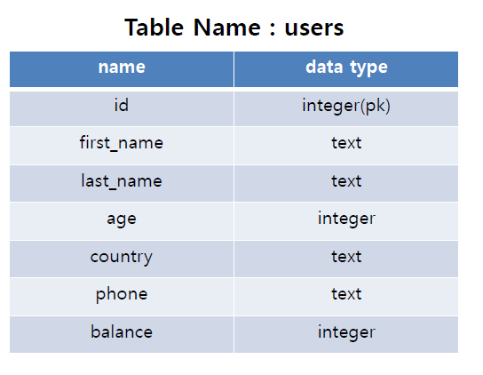
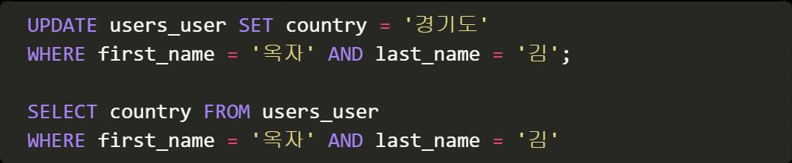

# Practice 0325

> SQL & ORM

* SQL
* Database
* SQL과 ORM 비교

## SQL ORM 비교하기

주어진 정보를 활용하여 작성된 SQL문과 대응하는 ORM문을 작상하고 실행하시오.

1) user 테이블 전체 데이터를 조회하시오.

2) id가 19인 사림의 age를 조회하시오.

3) 모든 사람의 age를 조회하시오.

4) age가 40 이하인 사림들의 id와 balance를 조회하시오.

5) last_name이 ‘김’이고 balance가 500 이상인 사람들의 first_name을 조회하시오.

6) first_name이 ‘수’로 끝나면서 행정구역이 경기도인 사람들의 balance를 조회하시오.

7) balance가 2000 이상이거나 age가 40 이하인 사람의 총 인원수를 구하시오.

8) phone 앞자리가 ‘010’으로 시작하는 사람의 총원을 구하시오.

9) 이름이 ‘김옥자’인 사람의 행정구역을 경기도로 수정하시오 .

10) 이름이 ‘백진호’인 사람을 삭제하시오 .

11) balance 를 기준으로 상위 4 명의 first_name, last_name, balance 를 조회하시오 .

12) phone 에 123’ 을 포함하고 age 가 30 미만인 정보를 조회하시오 .

13) phone 이 010’ 으로 시작하는 사람들의 행정 구역을 중복 없이 조회하시오 .

14) 모든 인원의 평균 age 를 구하시오 .

15) 박씨의 평균 balance 를 구하시오 .

16) 경상북도에 사는 사람 중 가장 많은 balance 의 액수를 구하시오 .

17) 제주특별자치도에 사는 사람 중 balance 가 가장 많은 사람의 first_name 을 구하시오 .

