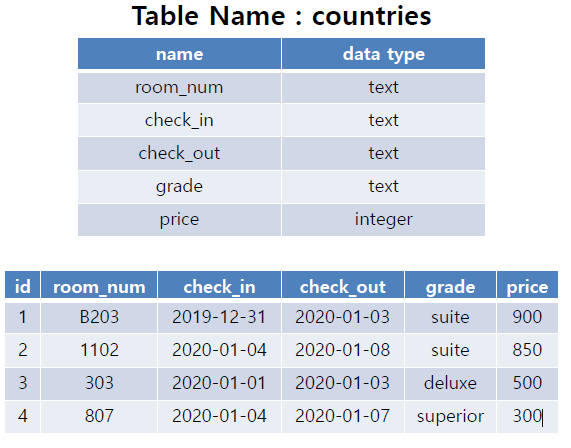

# Workshop 0325

> SQL & ORM


* SQL
* Database
* 테이블의 생성
* 데이터의 생성 및 조회




## SQL Query

위 countries 테이블을 바탕으로 아래 문제에 해당하는 SQL query문을 작성하고 실행하시오.


1) countries 테이블을 생성하시오.

```sqlite
sqlite> CREATE TABLE countries(
   ...> room_num TEXT,
   ...> check_in TEXT,
   ...> check_out TEXT,
   ...> grade TEXT,
   ...> price INTEGER
   ...> );
```


2) 데이터를 입력하시오.

```sqlite
sqlite> INSERT INTO countries
   ...> VALUES('B203', '2019-12-31', '2020-01-03', 'suite', 900)
   ...> ;
sqlite> INSERT INTO countries
   ...> VALUES('1102', '2020-01-04','2020-01-08', 'suite', 850)
   ...> ;
sqlite> INSERT INTO countries
   ...> VALUES('303', '2020-01-01', '2020-01-03', 'deluxe', 500)
   ...> ;
sqlite> INSERT INTO countries
   ...> VALUES('807', '2020-01-04', '2020-01-07', 'superior', 300);
```


3) 테이블의 이름을 hotels로 변경하시오.

```sqlite
sqlite> ALTER TABLE countries
   ...> RENAME TO hotels
   ...> ;
```


4) 객실 가격을 내림차순으로 정렬하여 상위 2개의 room_num과 price를 조회하시오.

```sqlite
sqlite> SELECT room_num,price FROM hotels ORDER BY price DESC LIMIT 2;
B203|900
1102|850
```


5) grade 별로 분류하고 분류된 grade 개수를 내림차순으로 조회하시오.

```sqlite
sqlite> SELECT grade, COUNT(grade)
   ...> FROM hotels
   ...> GROUP BY grade
   ...> ORDER BY COUNT(grade) DESC;
   -- ORDER BY COUNT(*) DESC;
   
```


6) 객실의 위치가 지하 혹은 등급이 deluxe인 객실의 모든 정보를 조회하시오.

```sqlite
sqlite> SELECT * FROM hotels WHERE room_num LIKE 'B%' OR grade='deluxe';
B203|2019-12-31|2020-01-03|suite|900
303|2020-01-01|2020-01-03|deluxe|500
```


7) 지상층 객실이면서 2020년 1월 4일에 체크인 한 객실의 목록을 price 오름차순으로
조회하시오.

```sqlite
sqlite> SELECT room_num FROM hotels WHERE room_num NOT LIKE 'B%' AND check_in='2020-01-04' ORDER BY price ASC;
807
1102
```

