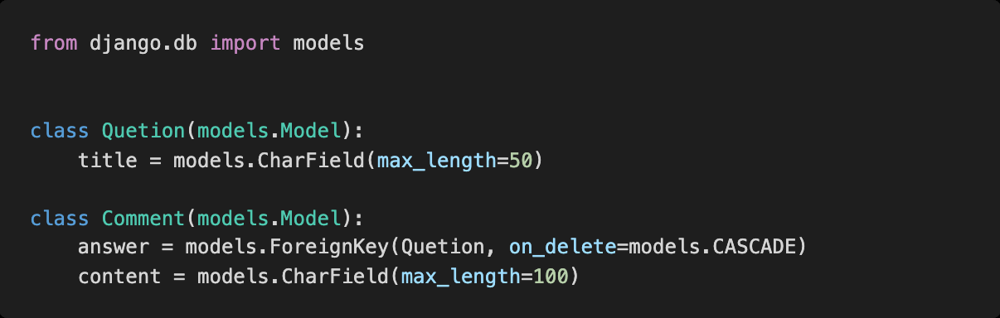
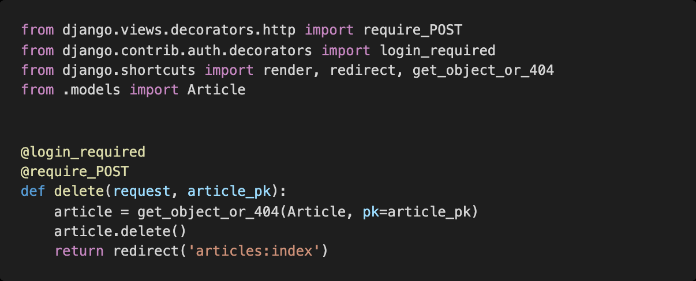
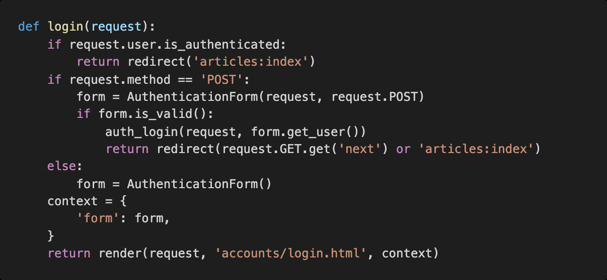

# Homework 0329

> Django Model Relationship


* Django 1:N Model Relation


## 1. 1:N True or False

각 문항을 읽고 맞으면 T, 틀리면 F 를 작성하고 틀렸다면 그 이유도 함께 작성하시오.


1) ForeignKey 는 부모 테이블의 데이터를 참조하기 위한 키이다

```
T

참조할수 있는데 무결성을 위해 pk를 불러오는것이다.

pk 역시 데이터 이다.
```


2) 1: N 관계에서 1 은 N 의 데이터를 직접 참조 할 수 있다

```
F, 직접참조는 불가능함, 역참조를 하는것 
```


3) on_delete 속성은 ForeignKey 필드의 필수 인자이다.

```
T, default값이 지정되어있지 않음 , 필수 인지이다.
```


4) 1: N 관계에서 외래 키는 반드시 부모 테이블의 PrimaryKey 여야 한다

```
F, 필수는 아니다. 참조무결성원칙에 따라서 PK를 선택하는것이지 반드시는 아니다.
```


## 2. ForeignKey column name

다음과 같이 이름이 articles인 app인 models.py에 작성된 코드를 바탕으로 테이블이 만들어 졌을 때, 데이터베이스에 저장되는 ForeignKey 컬럼의 이름과 테이블의 이름이 무엇인지 작성하시오.




```
article_comment

(앱이름_모델이름)

answer_id
```


## 3. 1:N model manager

위 2 번 문제 모델 관계를 바탕으로 어느 template 페이지가 다음과 같이 작성되어 있을 때 , 질문 Question) 에 작성된 모든 댓글 Comment) 을 출력하고자 한다 . 해당 template 에서 Question 객체를 사용할 수 있다면 빈칸 __(a)__ 에 들어갈 알맞은 코드를 작성하시오


```
question.comment_set.all
```


## 4. next parmeter

다음과 같이 게시글을 삭제하는 delete 함수와 로그인을 위한 login 함수가 작성되어 있다. 만약 비로그인 사용자가 삭제를 시도한다면 django 는 해당 사용자를 url 에 next 파라미터가 붙은 login 페이지로 redirect 한다

* /accounts/login/?next=/articles/1/


redirect 된 로그인 페이지에서 로그인에 성공했을 때 발생하는 HTTP response status code 를 작성하고 발생한 원인과 해결을 위해 코드를 수정하시오

* 게시글 삭제는 HTTP POST method 로만 가능하다
* 인증되지 않은 사용자는 메인페이지로 redirect 되어야 한다







```
redirect는 주소치고 엔터치는것과 똑같다 즉 get요청이다.

그렇기 때문에 다시올때 통과를 못함.

request.user.is_autenticated
```

