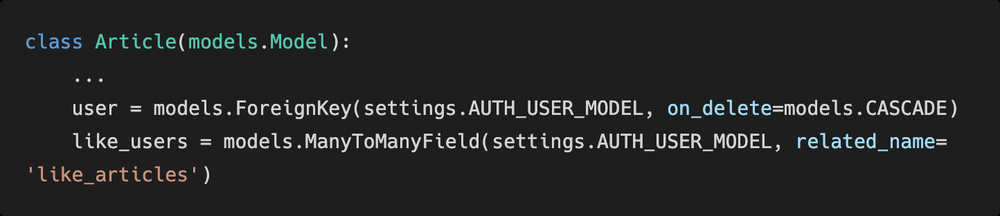
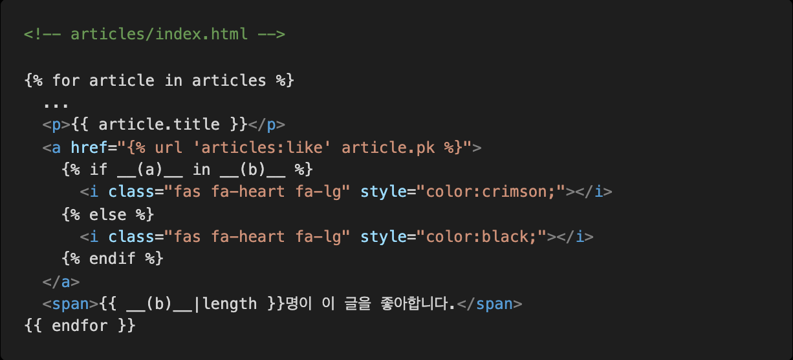
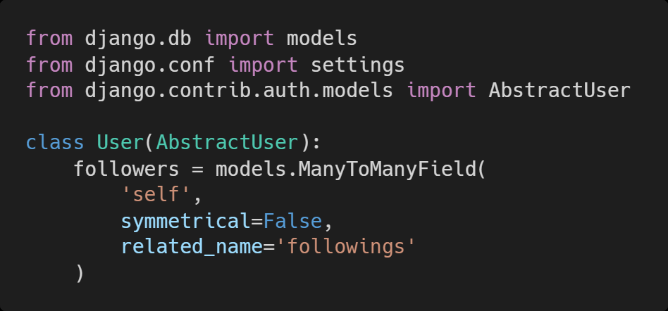
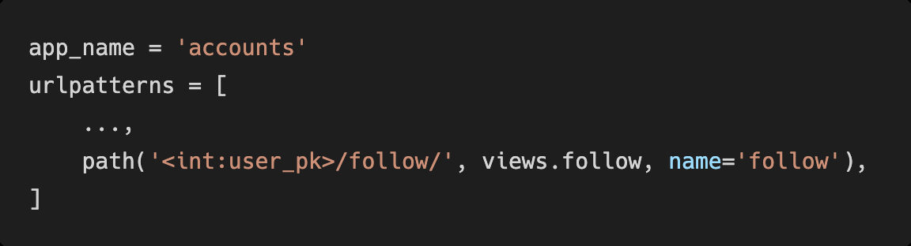
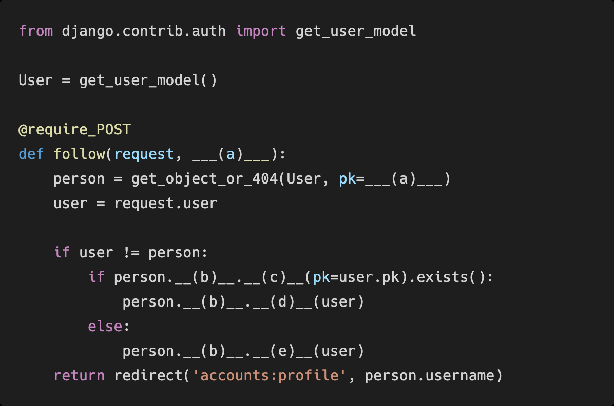
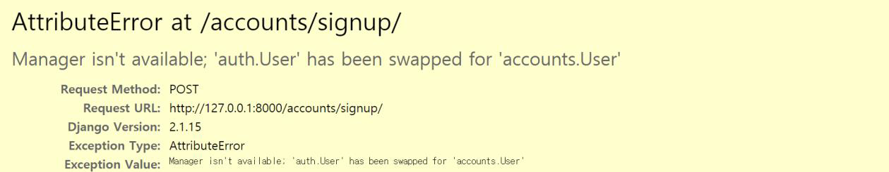
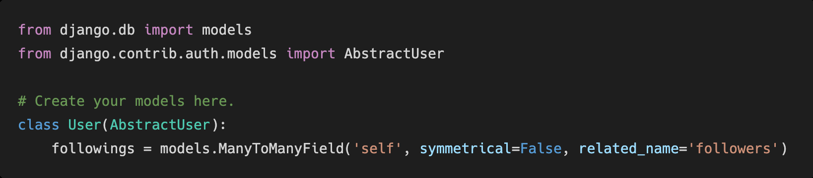
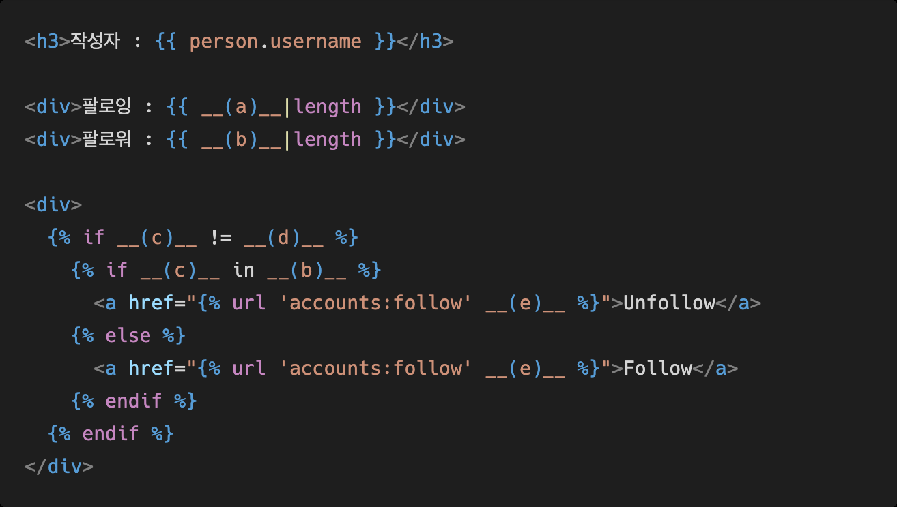

# Homework 0331

> Django Model Relationship


* Django Model Realtion


## 1. M:N Ture or False

각 문항을 읽고 맞으면 T, 틀리면 F를 작성하고 틀렸다면 그 이유도 함께 작성하시오.

1) Django 에서 1: N 관계는 ForeignKeyField 를 사용하고 M:N 관계는 ManyToManyField를
사용한다

```
T
```


2) ManyToManyField 를 설정하고 만들어지는 테이블 이름은 앱이름 클래스이름 지정한
필드이름 의 형태로 만들어진다 .

```
T
```


3) ManyToManyField 의 첫번째 인자는 참조할 모델 , 두번째 인자는 related_name 이 작성
되는데 두 가지 모두 필수적으로 들어가야 한다.

```
F
```


## 2. Like in templates

아래 빈 칸 (a)와 (b)에 들어갈 코드를 각각 작성하시오.






```
(a) request.user article.like.users

(b) 
```


## 3. Follow in views

모델 정보가 다음과 같을 때 빈칸 (a)와 (b)에 들어갈 코드를 각각 작성하시오.








```
(a) user_pk

(b) followers

(c) filter

(d) remove

(e) add
```


## 4. User AttributeError

아래와 같은 에러 메시지가 발생하는 이유와 이를 해결하기 위한 방법과 코드를 작성하시오.




```

```


## 5. related_name

아래의 경우 related_name을 필수적으로 설정해야 한다. 그 이유를 설명하시오.


```
역참조시에 모델 매니저 명령어가 겹치게 되므로 이를 바꿔준다.
```


## 6. follow templates

person 변수에는 view함수에서 넘어온 유저 정보가 담겨 있고,

모델 정보가 아래와 같을 때

빈칸 a, b, c, d, e에 들어갈 알맞은 코드를 각각 작성하시오.







```
(a)

(b)

(c)

(d)

(e)
```

