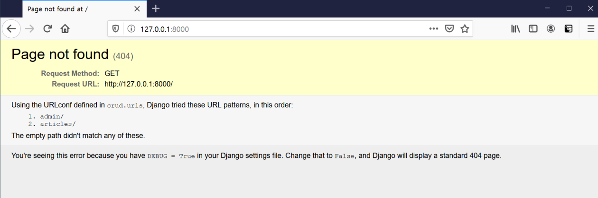
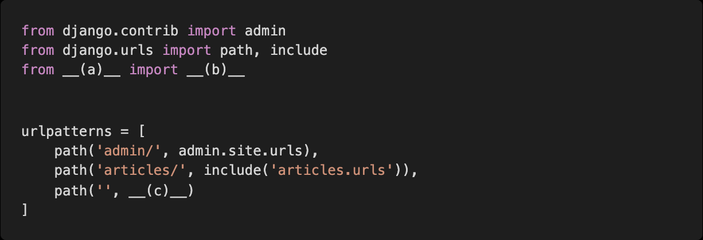
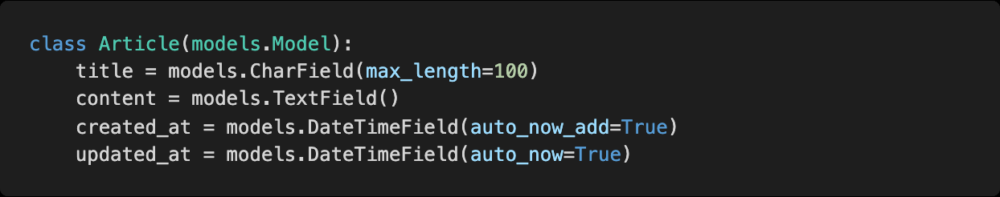
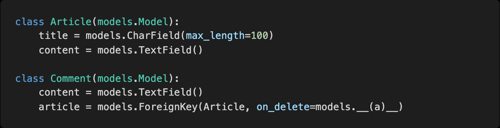
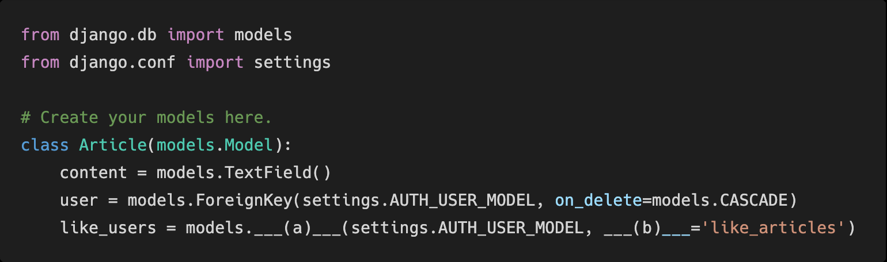
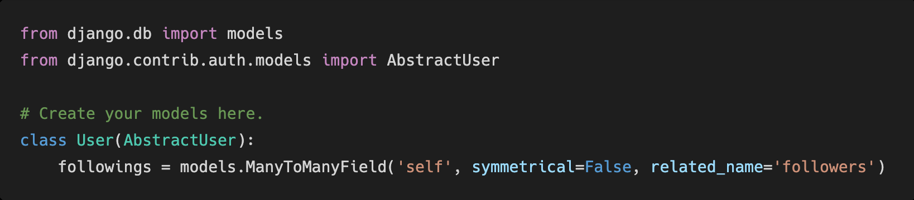

# Homework 0401

> Django Model Relationship


* Django


## 1. MTV

Django는 MTV로 이루어진 Web Framework다. MTV가 무엇의 약자이며 Django에서 각각 어떤 역할을 하고 있는지 작성하시오.


```
M : Model -> DB를 조작한다.

T : Template -> 사용자가 보는 화면 (html)

V: View -> 중간 관리자
```


## 2. 404 Page not found

기본적으로 ‘/ ’ 페이지에 접속하게 되면 아래 사진처럼 Page not found 에러가 발생한다. ‘/ ’ 페이지에 접속했을 때 index.html 를 렌더링 하고자 한다 . 아래 빈칸에 알맞은 코드를 작성하시오. (프로젝트의 이름은 crud 이며 app 이름은 articles 이다 . index.html 파일을 렌더링 하는 view 함수의 이름은 index 라고 가정한다.)






## 3. templates and static

Django 프로젝트는 기본적으로 render 할 html과 같은 template 파일과 css,js와 같은 static 파일을 앱 폴더 내부의 templates와 static 이름의 폴더에서 찾는다.

만약 해당 위치가 아닌 임의의 위치에 파일을 위치시키고 싶으면 __(a)__ 파일의 __(b)__와 __(c)__라는 변수에 담긴 리스트의 요소를 정의하면 된다. 

빈칸 (a), (b), (c) 에 들어갈 내용을 작성하시오 .


```
(a) settings.py

(b) TEMPLATES

(c) STATICFILES_DIRS
```


## 4. migration

아래는 그림과 같이 Django에서 선언한 Model을 Database에 반영하는 과정에서 사용하는 명령어에 대한 설명이다. 각 설명에 해당하는 명령어를 작성하시오.

(app 이름은 articles이다.)



1) 마이그레이션 생성

```bash
$ python manage.py makemigrations
```


2) 마이그레이션 DB 반영 여부 확인

```bash
$ python manage.py showmigrations
```


3) 마이그레이션에 대응되는 SQL 문 출력

```bash
$ python manage.py sqlmigrate
```


4) 마이그레이션 파일의 내용을 DB 에 최종 반영

```bash
$ python manage.py migrate
```


## 5. ModelForm True or False

각 문항을 읽고 맞으면 T, 틀리면 F 를 작성하시오.

1) POST 와 GET 방식은 의미론상의 차이이며 실제 동작 방식은 동일하다.

```
F
```


2) ModelForm 과 Form Class 의 핵심 차이는 Model 의 정보를 알고 있는지의 여부이다.

```
T
```


3) AuthenticationForm 은 User 모델과 관련된 정보를 이미 알고 있는 ModelForm 으로 구성되어 있다.

```
F
```


4) ModelForm 을 사용할 때 Meta 클래스에 fields 관련 옵션은 반드시 작성해야 한다.

```
T
```


## 6. media 파일 경로

사용자가 업로드한 파일이 저장되는 위치를 Django 프로젝트 폴더 (crud) 내부의 uploaded_files 폴더로 지정하고자 한다 . 이 때, settings.py 에 작성해야 하는 설정 2가지를 작성하시오.


## 7. DB True or False

각 문항을 읽고 맞으면 T, 틀리면 F 를 작성하시오 .

1) RDBMS 를 조작하기 위해서 SQL 문을 사용한다

```
T
```


2) SQL 에서 명령어는 반드시 대문자로 작성해야 동작한다 .

```
F
```


3) 일반적인 SQL 문에서는 세미콜론 ( ; 까지를 하나의 명령어로 간주한다.

```
T
```


4) SQLite 에서 tables, .headers on 과 같은 dot( . ) 로 시작하는 명령어는 SQL 문이 아니다.

```
T
```


5) 하나의 데이터베이스 안에는 반드시 한 개의 테이블만 존재해야 한다.

```
F
```


## 8. on_delete

게시글과 댓글의 관계에서 댓글이 존재하는 게시글은 삭제할 수 없도록 즉, ProtectedError를 발생시켜 참조 된 객체의 삭제를 방지하는 __(a)__를 작성하시오.




## 9. Like in models

Article 모델과 User 모델을 M:N 관계로 설정하여 ‘ 기능을 구현하려고 한다. __(a)__ 와 __(b)__ 에 들어갈 내용을 작성하시오. 추가적으로 아래의 상황에서 __(b)__ 를 반드시 작성해야 하는 이유를 함께 작성하시오.




```
(a) ManyToManyField

(b) related_name
```


## 10. Follow in models

follow 기능을 구현하기 위해 accounts app 의 models.py 에 아래와 같은 모델을 작성하였다. Migration 작업 이후에 Database 에 만들어지는 중개 테이블의 이름을 작성하고 이 테이블의 id 를 제외한 컬럼 이름을 각각 작성하시오.




```
accounts_user_followings

from_user_id
to_user_id
```

