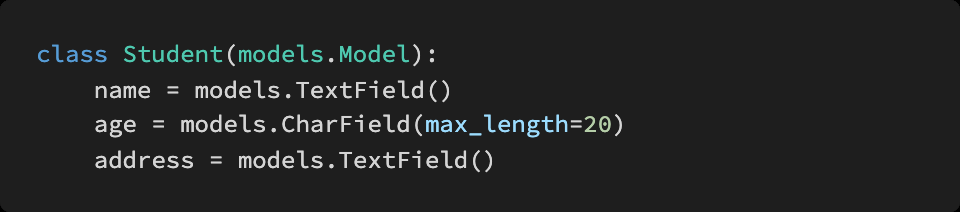

# Homework 0426

> Django REST Framework


* Django REST Framework


## 문제 1. 

아래의 설명을 읽고 T/F 여부를 작성 후 이유를 설명하시오


URI 는 정보의 자원을 표현하고 자원에 대한 행위는 HTTP Method 로 표현한다

```
T / RESTful에 대한 설명
```

HTTP Method 는 GET 과 POST 두 종류가 있다

```
F / PUT, DELETE등 더 많음
```

일반적으로 URI 마지막에 슬래시 `/` 는 포함하지 않는다

```
F / Trailing slash, django에서는 자동으로 붙여주는데 일반적으로는 아님
```

https://www.fifa.worldcup/teams/team/43822/ 는 계층 관계를 잘 표현한 RESTful 한 URI 라고 할 수 있다.

```
F
```


## 문제 2. 

다음의 HTTP status code의 의미를 간략하게 작성하시오.


* 200 - 성공
* 400 - x
* 401 - 미승인
* 403 - 권한 x
* 404 - page not found
* 500 - 서버 동작하지 않을시


## 문제 3. 

아래의 모델을 바탕으로 Serializer를 정의하려 한다. serializers.py 파일에 StudentSerializer를 작성하시오.




```python
class StudentSerializer(serializer.Model)
	......
```


## 문제 4. 

Serializers의 의미를 DRF(Django REST Framework) [공식문서](https://www.django-rest-framework.org/)를 참고하여 간단하게 설명하시오.


```

```

