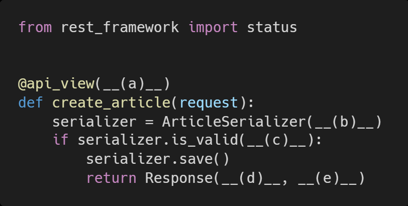

# Homework

> Django REST Framework


* Djano REST Framework
* HTTP Methods


## 문제 1.

아래의 설명을 읽고 T/F 여부를 작성 후 이유를 설명하시오.


JSON 포맷의 데이터로 응답하기 위해서는 반드시 DRF 를 사용해야 한다.

```
F / django 내부에서도 JSON으로 응답을 할 수 있음, JSON Response사용
```

DRF 가 제공하는 기본 Form 을 통해서만 여러 HTTP Method 를 테스트 해볼 수 있다.

```
F / POST
```

api_view 데코데이터를 사용하지 않아도 HTTP Method 에 대한 요청에 응답할 수 있다.

```
F / 데코레이터 사용하지 않으면 에러 발생, 무조건 씌워야함
```

Serializers 는 Queryset 객체를 JSON 포맷으로 변환 할 수 있는 python 데이터 타입으로 만 들어준다.

```
T / 정의이다.
```


## 문제 2.

REST API 디자인 가이드


REST API 디자인 설계 시 가장 중요한 항목을 2 가지로 요약한다면, 정보의 자원을 표현해야 하는 __(a)__ 와 자원의 대한 행위를 표현하는 __(b)__ 라고 할 수 있다. 빈칸 a, b 에 들어갈 알맞은 답을 작성하시오.


```
(a) URI

(b) HTTP method
```


## 문제 3.

아래에서 빈칸 a, b, c, d, e 에 들어갈 코드를 작성하시오.

해당 view 함수는 유효성 검사를 통과 했을 경우 serializer 데이터와 http status code 201 를 반환한다.




```
(a) ['POST']

(b) data=request.data

(c) raise_exception=True

(d) serializer.data

(e) status=status.HTTP_201_CREATED
```

