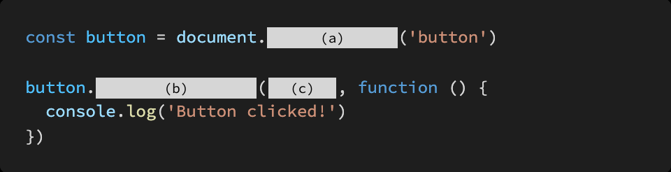

# Homework 0428

> JavaScript 기초


* JavaScript
* DOM(Document Object Model) 조작


<br>

## 문제 1.

아래의 설명을 읽고 T/F 여부를 작성하시오.


document.createElement 메서드를 통해 HTML 요소를 생성할 수 있다.

```
T
```

EventTarget .addEventListener (type, listener) 에서 listener 에 작성되는 콜백 함수의 첫번째 매개변수는 발생한 이벤트를 설명하는 Event 에 기반한 객체이다.

```
T
```

event .preventDefault 메서드를 통해 이벤트 동작을 취소할 수 있다.

```
T 
```

부모 노드에서 자식 노드를 추가하는 유일한 방법은 append 메서드 뿐이다.

```
F / appendChild 가 있다.
```


<br>

## 문제 2.

DOM Event에는 다양한 종류의 Event가 존재한다. 아래 제시된 Event들이 각각 어떤 시점에 발생하는지 다음 MDN 문서를 참고하여 간단하게 작성하시오.  [링크](developer.mozilla.org)

click, mouseover, mouseout, keydown, keyup, load, scroll, change, input


click - 클릭시

mouseover - 마우스 올렸을때 

mouseout - 마우스가 나갔을때

keydown  - 키 눌렀을때 

keyup - 키 눌렀다가 뗐을때

load

scroll

change

input


<br>

## 문제 3.

다음은 버튼을 클릭했을 때, 콘솔창을 통해 메시지를 확인하는 코드이다.

(a), (b), (c)에 들어갈 코드를 작성하시오.




```
(a) querySelector

(b) addEventeListener

(c)'click'
```


