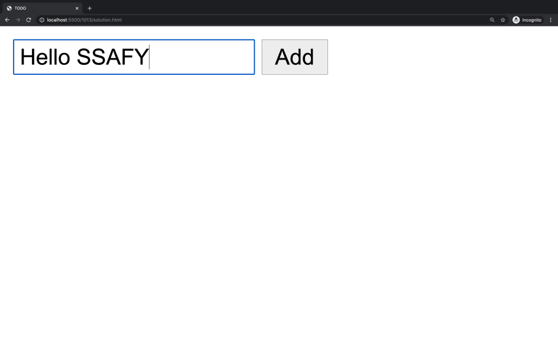

# Workshop 0428

> JavaScript 기초

* JavaScript
* DOM 조작에 대한 이해

## 문제

제시된 CREATE, READ 기능을 충족하는 todo app을 완성하시오.

필수사항 

* form 태그를 사용한다.
* submit 되었을 시 todo가 작성된다.
* 작성 된 todo는 ul태그의 li 태그로 추가된다.
* 작성 후 input value 값은 초기화 된다.
* 빈 값인 데이터는 입력을 방지한다.

