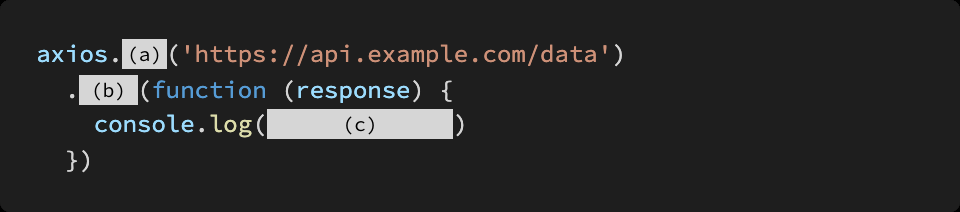

# Homework

> JavaScript 심화


* Asynchronous JavaScript


## 문제 1.

아래의 설명을 일고 T/F 여부를 작성하시오.


JavaScript 는 single threaded 언어로 한번에 한가지 일 밖에 처리하지 못한다.

```
T
```

setTimeout 은 브라우저의 Web API 를 사용하는 함수로 Web API 에서 동작이 완료되면 Call Stack 에 바로 할당된다.

```
F / Task Queue에 할당된다.
```

Promise 객체를 생성할 때 인자로 받는 callback 함수인 resolve 와 reject 는 비동기 처리가 성공 실패 했을 경우 어떠한 값을 전달할지 결정한다.

```
T
```

Promise 객체의 .then 메서드는 오류 없이 resolve 되었을 때 실행되는 함수이며, .catch 메서드는 도중에 오류가 발생하여 reject 되었을 때 실행되는 함수이다.

```
T
```


## 문제 2.

JavaScript에서 동기와 비동기 함수의 차이점을 서술하시오.


-> 동기는 다른 작업을 기다리는 반면에 비동기는 그렇지 않다.


## 문제 3.

다음은 axios를 사용하여 API 서버로 요청을 보내고, 응답 데이터를 출력하는 코드이다. (a), (b), (c)에 들어갈 코드를 작성하시오.




```
(a) get

(b) then (성공하면 이라서)

(c) response.data (결과값을 출력)
```

