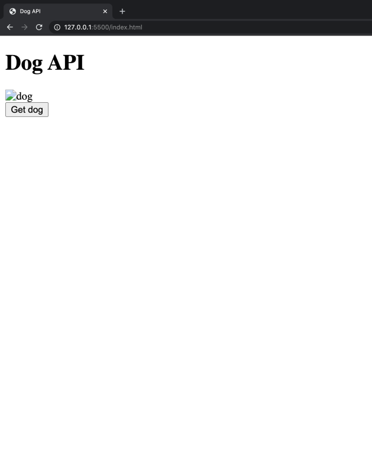
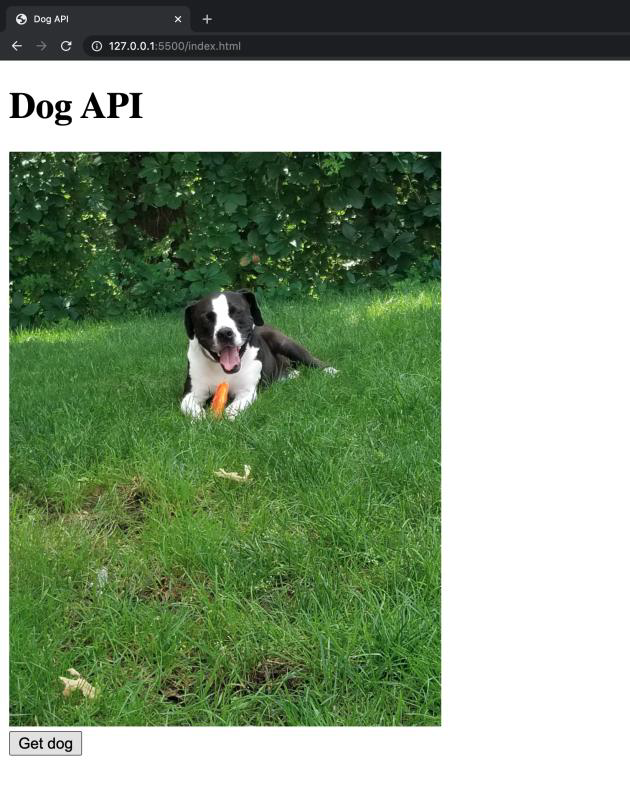

# Workshop 0503

> JavaScript 심화


* JavaScript
* AJAX 요청에 대한 이해


## 문제

공유된 HTML 코드의 주석과 마크업을 참고하여, 버튼을 클릭하면 axios를 통해 API 요청을 보내고 받아온 이미지 데이터를 페이지에 렌더링 하는 앱을 완성하시오.

API 링크 : https://dog.ceo/






## 과정


Axios  CDN : https://github.com/axios/axios

```html
<script src="https://cdn.jsdelivr.net/npm/axios/dist/axios.min.js"></script>
```

