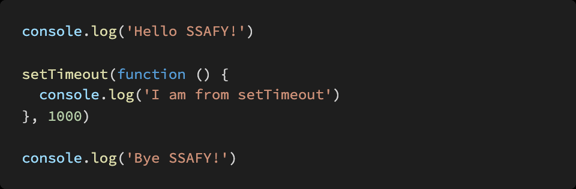

# Homework 0504

> JavaScript 심화


## 문제 1.

아래의 설명을 읽고 T/F 여부를 작성하시오.

Event Loop 는 Call Stack 이 비워지면 Task Queue 의 함수들을 Call Stack 으로 할당하는 역할을 한다.

```
T
```

XMLHttpRequest (XHR) 은 AJAX 요청을 생성하는 JavaScript API이다. XHR의 메서드로 브라우저와 서버간의 네트워크 요청을 전송할 수 있다.

```
T
```

axios 는 XHR(XMLHttpRequest) 을 보내고 응답 결과를 Promise 객체로 반환해주는 라이브러리이다.

```
T -> axios는 요청을 보내는데 실제로는 XHR을 보내는 것 이다.
```


## 문제 2.

아래의 코드가 실행되었을 때 Web API, Task Queue, Call Stack 그리고 Event Loop에서 어떤 동작이 일어나는 지 서술하시오.




```
첫번째단락 세번째단락 두번째 단락 순으로 작동된다.
```


## 문제 3.

JS는 Event loop를 기반으로 하는 Concurrency model을 가지고 있다고 한다. Concurrency 키워드의 특징을 작성하고, 이와 비슷한 키워드로 비교되는 Parallelism의 개념과 두 개념의 차이점을 서술 하시오.


A) Concurrency는 동시에 실행 x 멀티태스킹 개념 Parallelism은 일이 동시에 일어나며 한번에 처리가 되는 것이다.

