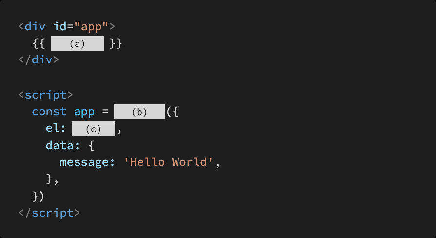
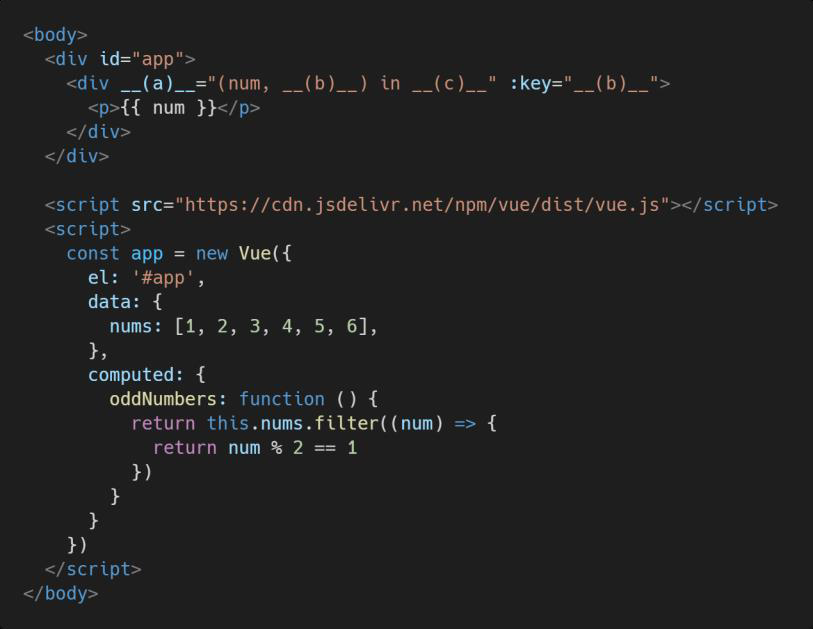
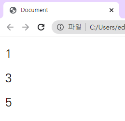

# Homework 0506

> Vue 기초


* Vue 기초 문법 및 개념


## 문제 1.

아래의 설명을 읽고 T/F 여부를 작성하시오.

SPA 는 Single Pattern Application 의 약자이다

```
F / Single Page Application의 약자이다.
```

SPA 는 웹 애플리케이션에 필요한 모든 정적 리소스를 한 번에 받고 , 이후부터는 페이지 갱신에 필요한 데이터만 전달받는다

```
T
```

Vue.js 에서 말하는 '반응형'은 데이터가 변경되면 이에 반응하여 연결된 DOM 이 업데이트되는 것을 의미한다

```
T
```


## 문제 2. 

MVVM은 무엇의 약자이고, 해당 패턴에서 각 파트의 역할은 무엇인지 간단히 서술하시오.


Model - View - View Model


Model : JS Obj. 자료구조

View : DOM 데이터의 변화에 따라서 바뀌는 대상

ViewModel : Vue Instance, Data와 DOM에 관련된 모든 일을 처리


## 문제 3.

다음의 빈칸에 들어갈 코드를 작성하시오.




(a) message

(b) new Vue

(c) '#app'


## 문제 4.

아래의 설명을 읽고 T/F 여부를 작성하시오.

동일한 요소에 v for 와 v if 두 디렉티브가 함께 작성된 경우, 매 반복 시에 v if 의 조건문으로 요소의 렌더링 여부를 결정한다.

```
F / v-for 가 우선순위가 더 높다.
```

v bind 디렉티브는 ““@@“, v on 디렉티브는 ““::” 약어 을 제공한다.

```
F / v-bind -> :  v-on -> @ 서로바뀌어 있다.
```

v model 디렉티브는 input, textarea , select 같은 HTML 요소와 단방향 데이터 바인딩을 이루기 때문에 v model 속성값의 제어를 통해 값을 바꿀 수 있다.

```
F / 양방향 바인딩을 한다.
```


## 문제 5.

computed와 watch의 개념과 그 차이에 대해서 간단히 서술하시오.


computed는 선언형 프로그래밍 방식으로 특정 값이 변동하면 특정값을 새로 계산해서 보여준다.

watch는 명령형 프로그래밍 방식으로 특정 값이 변동하면 다른 작업을 한다.


## 문제 6.

다음은 홀수 데이터만 렌더링 하는 Vue Application의 예시이다.

빈칸에 들어갈 코드를 작성하시오.






(a) v-for

(b) idx

(c) oddNumbers