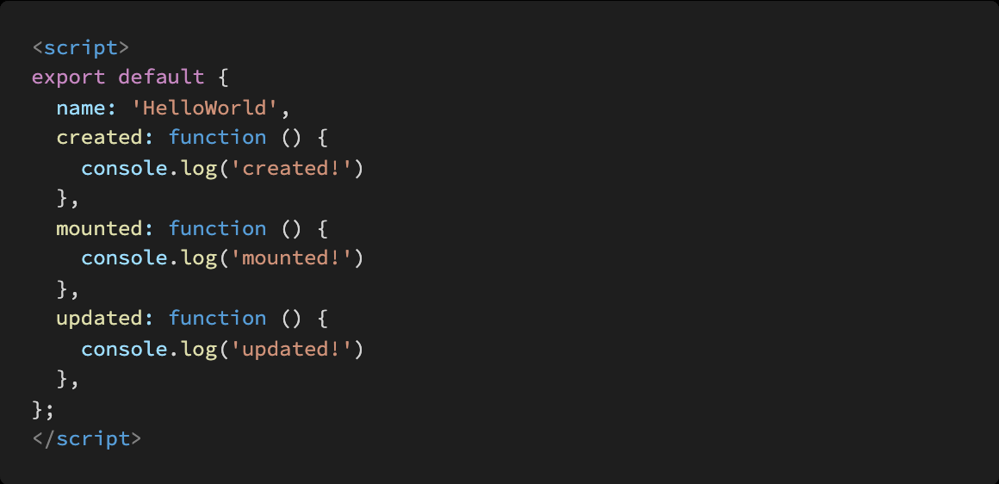

# Homework 0510

> Vue CLI


* Vue


## 문제 1.

아래의 설명을 읽고 T/F 여부를 작성하시오.


Vue 의 Life Cycle Hook 에서 created Hook 은 Vue template 에 작성한 요소들이 DOM 에 다 그려지는 시점에 실행된다.

```
F
```

npm 은 Node Package Manager 의 약자이며 npm 을 통해 설치한 package 목록은 package.json 파일에 자동으로 작성된다.

```
T
```

Vue CLI 를 통해 만든 프로젝트는 브라우저가 아닌 node.js 환경이기 때문에 DOM 조작이나 Web API 호출 등 Vanilla JS 에서의 기능을 사용할 수 없다.

```
F / Vue CLI 통해서도 Vanila JS 기능도 사용할 수 있음
```


## 문제 2. 

Vue Router에서 설정하는 history mode가 무엇을 뜻하는지 서술하시오.


```
한 페이지 내에서 모든것이 이루어지기때문에 -> 실제 주소는 바뀌지 않음 ( 이동이 이루어지지는 않음 )
uri만 바뀐것 처럼 보이는 것이
```


## 문제 3.

Vue Life Cycle Hook을 참고하여, 다음 Vue application을 실행했을 때 console 창에 출력되는 메시지를 작성하시오.




```
created! 
mounted!
```

